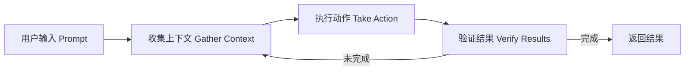

## 📌 引言

Claude Code 是 Anthropic 于 2025 年推出的 AI 编码 Agent，定位为"从终端到 IDE 的全链路自主开发工具"。与传统的代码补全工具（如 GitHub Copilot 的早期版本）不同，Claude Code 的设计哲学是**完整任务完成**（whole-task completion）：给定一个目标（如"修复这个认证 bug"），Agent 自主规划、读文件、编辑多文件、运行测试、提交代码，直到任务完成。

用户在任务文件中提及了关键词 **"Auto-dream"**。经过全面检索 Claude Code 官方文档（`code.claude.com`）、changelog（v2.1.51–v2.1.97，时间跨度 2026 年 2–4 月）、以及所有 Week 13–14 的发布周记，**"Auto-dream" 并非 Claude Code 的任何正式功能名称**。

然而，这一称谓并非无中生有。Claude Code 有一个名为 **Auto memory（自动记忆）** 的核心功能，于 v2.1.59 版本（约 2026 年 2–3 月）正式上线。"Auto-dream" 的命名逻辑与其惊人相似——就像人类在睡眠（dream）中巩固白天的记忆，Claude Code 的 Auto memory 也在任务执行间隙**自动提炼、沉淀会话中获得的知识**，以便在下次会话中使用。这正是本文的核心讨论对象。

本综述将围绕以下主线展开：
1. **Auto memory（Auto-dream）是什么**，它解决了什么问题，有哪些巧思
2. Claude Code 的整体架构与 Agentic Loop
3. 支撑 Auto memory 的周边生态：Skills、Hooks、Scheduling、Sub-agents

---

## 🧠 Claude Code 整体架构：Agentic Loop

在深入 Auto memory 之前，需要理解 Claude Code 的运行基础——**Agentic Loop（Agent 循环）**。

### 三阶段循环



当用户给出任务时，Claude Code 循环三个阶段：

| 阶段 | 描述 | 涉及工具 |
|------|------|---------|
| **收集上下文** | 读取文件、搜索代码库、理解结构 | `Read`, `Glob`, `Grep` |
| **执行动作** | 编辑文件、运行命令、调用 API | `Edit`, `Bash`, MCP tools |
| **验证结果** | 运行测试、检查输出、确认修复 | `Bash(npm test)`, `WebFetch` |

Claude Code 是一个包裹在 Claude 模型之外的 **Agentic Harness（Agent 外壳）**，负责提供工具、管理上下文、维护执行环境，将语言模型转变为能够行动的 Agent。

### 内置工具体系

| 分类 | 能力 |
|------|------|
| **文件操作** | 读取文件、编辑代码、创建/重命名文件 |
| **搜索** | Glob 模式匹配、正则内容搜索、代码库探索 |
| **执行** | Shell 命令、启动服务、运行测试、git 操作 |
| **Web** | 网络搜索、抓取文档、查询报错信息 |
| **Code Intelligence** | 类型错误检测、跳转定义、引用查找 |
| **Agent 管理** | 派生 Sub-agents、提问用户、任务协调 |

---

## 🔑 Auto Memory（"Auto-dream"）：跨会话的自动记忆巩固

> **这是本文核心，也是用户提问的核心。**

### 问题背景：LLM 的"会话失忆症"

Claude Code 的每次会话（session）都从一个**全新的上下文窗口**开始。你昨天花 30 分钟告诉 Claude"我们项目用 pnpm，不用 npm；测试用 vitest 而不是 jest；部署用 `./scripts/deploy.sh`"——明天打开新会话，Claude 已经忘了。

这个问题有两个传统解法：
1. **CLAUDE.md 文件**：用户手动维护一个 Markdown 指令文件，Claude 每次会话开始时读取
2. **在对话中重复提示**：每次会话手动告知上下文

前者需要用户主动写和维护，后者低效且容易遗漏。

### Auto Memory 的核心设计

Auto memory（v2.1.59+）让 **Claude 自己来记笔记**。

> *"Claude saves notes for itself as it works: build commands, debugging insights, architecture notes, code style preferences, and workflow habits. Claude doesn't save something every session. It decides what's worth remembering based on whether the information would be useful in a future conversation."*
> —— Claude Code 官方文档

**存储位置**：

```
~/.claude/projects/<project>/memory/
├── MEMORY.md          # 简洁索引，每次会话加载前 200 行或 25KB
├── debugging.md       # 调试模式的详细笔记
├── api-conventions.md # API 设计决策
└── <其他主题文件>     # Claude 自主创建
```

`<project>` 路径由 git 仓库派生，同一仓库的所有 worktree 和子目录共享同一套 Auto memory 目录。

**加载策略**：
- `MEMORY.md` 的前 200 行（或 25KB，取先到者）在每次会话开始时自动注入上下文
- 主题文件（如 `debugging.md`）**不**在启动时加载，Claude 按需读取
- 这是 **分层加载策略**：常用摘要常驻，详细细节按需调用

### Auto Memory 的巧思：类比睡眠记忆巩固

"Auto-dream"这个非官方命名非常精妙，因为它与认知神经科学中的**记忆巩固（Memory Consolidation）**模型高度对应：

```
人类记忆巩固模型：
  白天工作 → 海马体临时存储 → 睡眠中 → 皮层长期记忆
  
Claude Code Auto memory 模型：
  会话内学习 → 上下文临时存储 → 会话结束/间隙 → MEMORY.md 持久化
```

具体而言，Auto memory 有以下几个关键设计决策：

#### 1. Claude 主动判断"值得记什么"

Auto memory **不是每次对话结束都保存整个上下文**。Claude 会评估：哪些信息在未来的会话中有用？例如：
- ✅ "这个项目用 pnpm 而不是 npm" —— 有普遍价值，值得记忆
- ✅ "API 测试需要本地 Redis 实例" —— 防止未来调试误入歧途
- ❌ "我刚才问了关于 Button 组件的问题" —— 临时对话内容，无普遍价值

这种选择性记忆避免了 MEMORY.md 无限膨胀，保持摘要的信息密度。

#### 2. MEMORY.md 的容量限制与主题文件机制

MEMORY.md 只加载前 200 行/25KB。超出部分需移入独立主题文件（Claude 自动管理），并在 MEMORY.md 中留下索引指针。这类似于人类的**工作记忆与长期记忆分离**：工作记忆（MEMORY.md 摘要）快速可访问，长期记忆（主题文件）按需检索。

#### 3. 用户可审查和修改

Auto memory 是纯 Markdown 文件，用户随时可以：
- 通过 `/memory` 命令浏览所有记忆文件
- 直接编辑或删除不准确的记忆
- 告诉 Claude "记住 XXX"，Claude 会主动写入 Auto memory

这与黑箱式的隐式学习完全不同，提供了完整的透明度和控制权。

#### 4. 与 CLAUDE.md 的互补关系

| 特性 | CLAUDE.md | Auto Memory |
|------|-----------|-------------|
| **谁写** | 用户 | Claude |
| **内容** | 规则与指令 | 学习与模式 |
| **范围** | 项目/用户/组织 | 每个 working tree |
| **加载时机** | 每次会话完整加载 | 每次会话加载前 200 行/25KB |
| **类比** | 项目规范文档 | 个人工作笔记 |

两者协同工作：CLAUDE.md 是"公司规章"，Auto memory 是"员工的个人工作记录"。

#### 5. Sub-agent 也有独立的 Auto memory

Claude Code 支持 Sub-agents（子 Agent），每个 Sub-agent 可以维护自己独立的 Auto memory（需在配置中开启 `persistMemory: true`）。这使得专门的 Sub-agent（如"代码审查 Agent"）可以积累专属知识，而不污染主 Agent 的记忆空间。

### Auto Memory 的使用示例

**场景一：构建命令记忆**

```text
Session 1:
用户：运行一下测试
Claude：[运行 npm test，发现项目实际用 pnpm]
Claude：[自动写入 MEMORY.md]
  > Build: use pnpm, not npm. Test: pnpm vitest
  
Session 2（第二天）:
用户：运行测试
Claude：[读取 MEMORY.md，直接使用 pnpm vitest] ✅
```

**场景二：调试洞察记忆**

```text
Session 1:
用户：为什么 API 测试老是失败？
Claude：[调试后发现] 需要本地 Redis 实例（端口 6379）
Claude：[写入 debugging.md]
  > API tests require local Redis at localhost:6379. Run: redis-server
  
Session 2:
用户：API 测试又挂了
Claude：[读取 debugging.md] 我注意到上次你的 API 测试需要 Redis，让我先检查...
```

### 配置与控制

**开启/关闭**：

Auto memory 默认开启。关闭方法：
```json
// .claude/settings.json
{
  "autoMemoryEnabled": false
}
```
或环境变量：`CLAUDE_CODE_DISABLE_AUTO_MEMORY=1`

**自定义存储路径**（用于跨机器同步等场景）：
```json
{
  "autoMemoryDirectory": "~/my-custom-memory-dir"
}
```

---

## ⚙️ CLAUDE.md：手动持久化上下文的另一半

Auto memory 解决了 Claude 主动学习的问题，而 **CLAUDE.md** 解决了用户主动教学的问题。

### 多层级 CLAUDE.md 体系

Claude Code 支持多层级 CLAUDE.md，形成**上下文优先级链**：

| 级别 | 路径 | 作用范围 | 共享方式 |
|------|------|---------|---------|
| **托管策略** | `/etc/claude-code/CLAUDE.md` | 组织所有用户 | 运维部署 |
| **项目指令** | `./CLAUDE.md` 或 `./.claude/CLAUDE.md` | 项目团队 | Git 版本控制 |
| **用户指令** | `~/.claude/CLAUDE.md` | 个人所有项目 | 个人配置 |
| **本地私有** | `./CLAUDE.local.md` | 个人 + 当前项目 | 加入 .gitignore |

### 目录式规则管理

对于大型项目，可以将指令拆分到 `.claude/rules/` 目录，每个文件聚焦一个主题：

```
.claude/
├── CLAUDE.md           # 主要项目指令
└── rules/
    ├── code-style.md   # 编码风格
    ├── testing.md      # 测试约定
    └── security.md     # 安全要求
```

更强大的是 **路径作用域规则（Path-specific rules）**：

```yaml
---
paths:
  - "src/api/**/*.ts"
---
# API 开发规则
- 所有 API 端点必须包含输入验证
- 使用标准错误响应格式
```

这个规则只在 Claude 操作 `src/api/` 下的 TypeScript 文件时才加载，节约上下文空间。


---

## 🧩 Skills：可复用的工作流单元

**Skills**（技能）是 Claude Code 的"工具包"扩展机制。每个 Skill 是一个 `SKILL.md` 文件，包含指令和可选的辅助文件，Claude 在需要时加载执行。

### 与普通 Prompt 的根本区别

| 特性 | 普通对话 Prompt | Skills |
|------|----------------|--------|
| **作用范围** | 当前会话临时 | 持久化、可复用 |
| **触发方式** | 每次手动输入 | `/skill-name` 或 Claude 自动判断 |
| **上下文效率** | 每次消耗完整 token | 按需加载，描述常驻 |
| **权限控制** | 无 | `allowed-tools` 精细控制 |
| **团队共享** | 无法直接分享 | 可提交 Git 或打包插件 |

### Skills 的结构

```
my-skill/
├── SKILL.md           # 主指令文件（必需）
├── reference.md       # 详细参考文档（按需加载）
├── examples.md        # 示例（按需加载）
└── scripts/
    └── helper.py      # 辅助脚本（执行，非加载）
```

一个典型的 `SKILL.md` 示例：

```yaml
---
name: commit
description: 按照项目规范生成 commit message 并提交
disable-model-invocation: true  # 只允许用户手动触发
allowed-tools: Bash(git add *) Bash(git commit *) Bash(git status *)
---

提交当前更改：
1. 运行 git status 查看变更
2. 用 conventional commits 格式生成 message
3. 执行 git add 和 git commit
```

### 关键 Frontmatter 字段

| 字段 | 作用 |
|------|------|
| `name` | Skill 名称，即 `/slash-command` |
| `description` | Claude 判断是否自动触发的依据 |
| `disable-model-invocation: true` | 只允许用户手动 `/skill-name`，防止 Claude 自行决定触发 |
| `user-invocable: false` | 只允许 Claude 自动触发，不在菜单显示 |
| `allowed-tools` | 该 Skill 激活时可免审批直接使用的工具 |
| `context: fork` | 在独立 Sub-agent 上下文中运行，隔离主会话 |
| `paths` | 仅当操作特定路径下的文件时自动激活 |

### 动态上下文注入（Shell 注入）

Skills 支持 `` !`command` `` 语法，在指令发给 Claude 之前先运行 Shell 命令，将结果注入：

```yaml
---
name: pr-summary
description: 总结 PR 变更
context: fork
---

## Pull Request 信息
- Diff: !`gh pr diff`
- 评论: !`gh pr view --comments`
- 变更文件: !`gh pr diff --name-only`

请总结这个 Pull Request 的主要变更和影响。
```

Claude 看到的是已经填充了真实 PR 数据的指令，而不是命令本身。这是**预处理注入**，不依赖 Claude 执行命令。

### 内置 Skills

Claude Code 内置了若干高价值 Skill：

| Skill | 用途 |
|-------|------|
| `/batch <指令>` | 将大规模代码库变更拆分为 5–30 个独立单元，并行 Agent 执行，各自提 PR |
| `/simplify [关注点]` | 并行启动 3 个审查 Agent，检查代码质量/复用性/效率，合并修复 |
| `/loop [间隔] <提示>` | 按间隔重复执行提示（如 `/loop 5m check if deploy finished`） |
| `/debug [描述]` | 开启调试日志，分析当前会话问题 |

---

## 🔗 Hooks：Agent 行为的确定性拦截器

**Hooks** 是 Claude Code 中最接近"确定性控制"的机制。Skills 和 CLAUDE.md 只是给 Claude 提供建议，Claude 有可能不遵循。Hooks 则是**强制执行**的 Shell 脚本/HTTP 请求/Agent，在 Claude 每次使用工具的关键时刻触发。

### Hook 触发时机

| Hook 事件 | 触发时机 |
|-----------|---------|
| `PreToolUse` | Claude 准备使用任何工具之前 |
| `PostToolUse` | 工具执行完成之后 |
| `Notification` | Claude 生成通知时 |
| `Stop` | Claude 完成任务、停止响应时 |
| `SubagentStop` | Sub-agent 停止时 |
| `InstructionsLoaded` | CLAUDE.md/rules 加载完成时 |
| `TeammateIdle` | Agent 团队中某个 teammate 空闲时 |
| `TaskCreated/Completed` | Agent 团队任务创建/完成时 |

### Hook 类型

Claude Code 支持 4 种 Hook 实现类型：

```json
// 1. Command Hook：Shell 脚本
{
  "type": "command",
  "command": ".claude/hooks/block-rm.sh"
}

// 2. HTTP Hook：远程 webhook
{
  "type": "http",
  "url": "http://localhost:8080/hooks/pre-tool-use"
}

// 3. Prompt Hook：让小 Claude 模型判断
{
  "type": "prompt",
  "prompt": "这个命令安全吗？$ARGUMENTS"
}

// 4. Agent Hook：派生 Sub-agent 执行验证
{
  "type": "agent",
  "prompt": "验证部署配置是否安全"
}
```

### 典型用例：阻断危险命令

```json
// .claude/settings.json
{
  "hooks": {
    "PreToolUse": [{
      "matcher": "Bash",
      "hooks": [{
        "if": "Bash(rm *)",
        "type": "command",
        "command": ".claude/hooks/block-rm.sh"
      }]
    }]
  }
}
```

Hook 脚本通过退出码和 stdout 向 Claude 反馈结果：
- **退出码 0**：允许，继续执行
- **退出码 2 + stdout JSON**：拦截并反馈原因给 Claude（让 Claude 尝试其他方案）
- **设置 `permissionDecision: "deny"`**：明确拒绝

### 条件 Hook（v2.1.85）

Hooks 可以声明 `if` 字段，仅在特定条件下触发，减少不必要的进程开销：

```json
{
  "hooks": {
    "PreToolUse": [{
      "hooks": [{
        "if": "Bash(git commit *)",
        "type": "command",
        "command": ".claude/hooks/lint-staged.sh"
      }]
    }]
  }
}
```

这个 Hook 只在 `git commit` 时触发，而不是每次 Bash 调用都触发。

---

## ⏰ 定时任务（Scheduling）：无人值守的 Agent

Claude Code 支持三种定时执行模式，让 Agent 在无人值守的情况下自动运行：

### 三种模式对比

| 模式 | 运行位置 | 需要机器开机 | 需要会话打开 | 本地文件访问 | 最小间隔 |
|------|---------|------------|------------|------------|---------|
| **Cloud Tasks** | Anthropic 云基础设施 | ❌ | ❌ | ❌（新 clone） | 1 小时 |
| **Desktop Tasks** | 本机 | ✅ | ❌ | ✅ | 1 分钟 |
| **`/loop`** | 本机（会话内） | ✅ | ✅ | ✅ | 1 分钟 |

### Cloud Scheduled Tasks（云定时任务）

**核心优势**：电脑关机也能运行。任务运行在 Anthropic 托管的 VM 上，每次运行时 clone 指定的 GitHub 仓库，自主完成工作并提 PR。

典型用例：
```text
每天上午 9 点，分析昨天合入的 PR，检查是否有安全漏洞，
生成安全报告并发 Slack 通知。

每周一，审计所有 npm 依赖更新，提一个依赖升级 PR。

每次 CI 失败时，分析失败原因并尝试自动修复。
```

创建方式：
```bash
# 在 CLI 中对话创建
/schedule daily PR review at 9am

# 或直接访问 Web 界面
# claude.ai/code/scheduled
```

**权限设计**：Cloud Tasks 默认无权限提示（完全自主运行）。Claude 只能推送到 `claude/` 前缀的分支，防止意外修改受保护的主干分支。

### Desktop Scheduled Tasks（桌面定时任务）

**核心优势**：可以直接访问本机文件和工具，比 Cloud Tasks 更强大，但需要保持桌面 App 运行。

配置存储在 `~/.claude/scheduled-tasks/<task-name>/SKILL.md`，可以直接编辑任务提示：

```yaml
---
name: morning-review
description: 每天上午检查 PR 状态
---

检查所有待审查 PR，给出优先级排序，
如果有超过 2 天没有回应的 PR，发 Slack 提醒。
```


---

## 🤖 Sub-agents 与 Agent Teams：并行与协作

Claude Code 支持两种多 Agent 模式：Sub-agents（子 Agent）和 Agent Teams（Agent 团队）。

### Sub-agents：上下文隔离的专用 Agent

Sub-agent 是独立的 Claude Code 实例，拥有自己的上下文窗口。当主 Agent 将任务委托给 Sub-agent 时，Sub-agent 的工作不会占用主会话的上下文空间。

**最大价值**：通过隔离复杂工作来**保护主上下文**。例如，让 Sub-agent 做代码库探索，探索结果只以摘要形式返回主 Agent，而不是将完整的文件内容注入主上下文。

定义一个 Sub-agent（`.claude/agents/security-reviewer.md`）：

```yaml
---
name: security-reviewer
model: claude-sonnet-4-5
tools: [Read, Grep, Glob]  # 限制只读工具
---

你是一个专注安全的代码审查员。
专门检查：输入验证、认证逻辑、SQL 注入风险、敏感信息泄露。
只读取文件，不做任何修改。
```

Sub-agent 可以开启独立的 Auto memory（持久记忆）：

```yaml
---
name: code-reviewer
persistMemory: true  # 开启持久记忆
---
```

这样，这个代码审查 Sub-agent 会积累关于这个代码库的专属知识。

### Agent Teams：协作与辩论的 Agent 网络

Agent Teams 是实验性功能（默认关闭），允许多个 Claude 实例**相互通信**，共享任务列表，自主分工协作。

与 Sub-agents 的核心区别：

| 特性 | Sub-agents | Agent Teams |
|------|------------|-------------|
| **通信方向** | 只向主 Agent 汇报 | Teammates 互相通信 |
| **协调方式** | 主 Agent 统一调度 | 共享任务列表，自主认领 |
| **适用场景** | 专注、独立的子任务 | 需要讨论和辩论的复杂任务 |
| **token 成本** | 较低 | 较高（每个 teammate 独立上下文） |

典型用例——多假说调试：

```text
用户报告：App 在一次消息后退出，而不是保持连接。

创建 5 个 Agent 同时调查不同假说，让他们互相质疑对方的理论，
像科学辩论一样。将达成的共识更新到 findings.md。
```

多假说并行调查的关键价值：单个 Agent 找到一个可能原因后就会停止探索，而多个 Agent 相互质疑可以筛选出更可靠的根因。

---

## 🔎 问题回答：Auto-dream 解决了什么问题，有哪些巧思

> 以下直接回答任务文件中的核心问题。

### ❓ 它解决了什么问题？

**核心问题：LLM Agent 的"会话失忆症"——每次会话都从零开始。**

具体痛点：
1. **反复重新交代上下文**：用户每次需要告诉 Agent "我们用 pnpm"、"测试文件在这个路径"等信息
2. **调试洞察无法积累**：上次花 2 小时调试发现的根因，下次又要从头来过
3. **用户手动维护 CLAUDE.md 的负担**：需要用户主动思考"哪些信息值得持久化"并手动写入
4. **跨项目/跨团队的知识孤岛**：每个人的经验无法系统地沉淀

Auto memory 直接攻击第 1–3 个痛点：**让 Claude 自己记笔记，自己判断什么值得记，下次自动带入**。

### 🎯 有哪些巧思？

**巧思 1：选择性记忆，不是全量保存**

Auto memory 的最大陷阱是"保存一切"。如果把每次会话的所有内容都存起来，MEMORY.md 会迅速膨胀，变成噪声大于信号的日志。

Claude Code 的解法：让 Claude 自主判断"这个信息在未来会话中有价值吗"。这一判断基于通用价值（build 命令、项目结构规律、反复出现的调试模式），而不是对话临时上下文。

**巧思 2：两层记忆架构（工作记忆 + 长期记忆）**

```
MEMORY.md（前 200 行/25KB 常驻上下文）
    ↓ 索引指向
debugging.md / api-conventions.md / ...（按需读取）
```

这与人脑架构高度相似：工作记忆（前额叶，快速访问，容量有限）+ 长期记忆（皮层，大容量，检索需要）。

"自动梦境巩固"的类比在此尤为贴切：MEMORY.md 是大脑在"睡眠"结束后留在前额叶的精华摘要，而长期知识则被归档到更深层的存储。

**巧思 3：完全透明可审查**

Auto memory 是普通 Markdown 文件，不是黑盒神经网络权重更新。用户可以：
- 随时读取 `~/.claude/projects/<project>/memory/`
- 直接编辑（修正错误记忆）
- 删除（重置记忆）
- 用 `/memory` 命令查看当前会话加载了哪些记忆

这解决了 AI 工具透明度的核心问题：用户不需要猜测 Claude "记住了什么"。

**巧思 4：Sub-agent 独立记忆空间**

不同专用 Agent 可以各自积累专属记忆，不互相污染。"安全审查 Agent"记住了这个项目的常见安全模式，"测试 Agent"记住了测试框架约定，主 Agent 记住了通用工作流。每个 Agent 的记忆都是高信噪比的专业知识。

**巧思 5：与 CLAUDE.md 的职责分离**

| 谁写 | 写什么 | 类比 |
|------|------|------|
| 用户写 CLAUDE.md | 应该遵守的规则、架构约定 | 公司规章制度 |
| Claude 写 Auto memory | 学到的事实、发现的规律 | 员工个人工作笔记 |

两者各司其职，用户不需要把所有知识都手动维护在 CLAUDE.md 中，Claude 会自己补充应该记住的内容。

---

## 🌐 Claude Code 生态总览

```mermaid
graph TB
    U[用户] --> CC[Claude Code CLI/IDE/Web]
    CC --> AL[Agentic Loop]
    
    AL --> T[内置工具 Tools]
    AL --> M[记忆系统 Memory]
    AL --> E[扩展系统]
    
    M --> CM[CLAUDE.md\n用户手动维护]
    M --> AM[Auto Memory\nClaude 自动维护]
    
    E --> SK[Skills 技能]
    E --> HK[Hooks 钩子]
    E --> MCP[MCP 外部服务]
    E --> SA[Sub-agents 子Agent]
    E --> AT[Agent Teams 实验性]
    E --> SC[Scheduling 定时任务]
    
    SC --> CT[Cloud Tasks\nAnthopic 云]
    SC --> DT[Desktop Tasks\n本机]
    SC --> LP[/loop 会话内]
```

Claude Code 构建了一个**完整的 Agent 能力栈**：
- **执行层**：内置工具（文件、Shell、Web、Code Intelligence）
- **记忆层**：CLAUDE.md + Auto memory（持久化知识）
- **扩展层**：Skills（工作流复用）+ Hooks（确定性控制）+ MCP（外部集成）
- **协作层**：Sub-agents（隔离子任务）+ Agent Teams（并行协作）
- **自动化层**：Cloud/Desktop/Loop 定时任务

这一体系的核心设计哲学是：**最大化 Agent 自主性，同时保持用户对关键决策的控制权**。

---

## 📝 总结与思考

### "Auto-dream"的本质：会话间知识蒸馏

Auto memory（"Auto-dream"）的本质是一个**知识蒸馏机制**：将会话中学到的、具有通用价值的知识，提炼并持久化，以便在未来的会话中作为先验知识使用。

这与大型语言模型的预训练过程有根本不同：预训练更新模型权重，而 Auto memory 是在**推理阶段**的外部记忆系统。Claude 的模型参数不变，改变的是其上下文输入。

### 当前局限性

1. **仅限机器本地**：Auto memory 存储在本机，不跨设备同步（Cloud Tasks 运行时不访问本机 Auto memory）
2. **容量限制**：MEMORY.md 只加载前 200 行/25KB，过长的记忆需要主动管理
3. **记忆质量依赖 Claude 判断**：Claude 有时可能记住不重要的内容，或遗漏重要内容
4. **无冲突解决机制**：如果 Auto memory 与 CLAUDE.md 中的指令冲突，没有明确的优先级规则

### 展望

Auto memory 代表了 AI 工具从"无状态工具"向"有状态伙伴"转变的第一步。随着长上下文窗口的不断扩大和跨会话记忆技术的成熟，未来的 AI 编码 Agent 可能不再需要区分"会话内上下文"和"跨会话记忆"，而是形成一个统一的连续知识体。

---

## 📚 参考来源

本综述所有内容均来自以下实际检索来源：

1. **Claude Code 官方文档** - [code.claude.com/docs/en/overview](https://code.claude.com/docs/en/overview)
2. **Auto Memory 文档** - [code.claude.com/docs/en/memory](https://code.claude.com/docs/en/memory)
3. **Sub-agents 文档** - [code.claude.com/docs/en/sub-agents](https://code.claude.com/docs/en/sub-agents)
4. **Agent Teams 文档** - [code.claude.com/docs/en/agent-teams](https://code.claude.com/docs/en/agent-teams)
5. **Skills 文档** - [code.claude.com/docs/en/skills](https://code.claude.com/docs/en/skills)
6. **Hooks 文档** - [code.claude.com/docs/en/hooks](https://code.claude.com/docs/en/hooks)
7. **Cloud Scheduled Tasks** - [code.claude.com/docs/en/web-scheduled-tasks](https://code.claude.com/docs/en/web-scheduled-tasks)
8. **Desktop Scheduled Tasks** - [code.claude.com/docs/en/desktop-scheduled-tasks](https://code.claude.com/docs/en/desktop-scheduled-tasks)
9. **How Claude Code Works** - [code.claude.com/docs/en/how-claude-code-works](https://code.claude.com/docs/en/how-claude-code-works)
10. **What's New Week 13 & 14** - [code.claude.com/docs/en/whats-new](https://code.claude.com/docs/en/whats-new)
11. **Changelog v2.1.51–v2.1.97** - [code.claude.com/docs/en/changelog](https://code.claude.com/docs/en/changelog)


