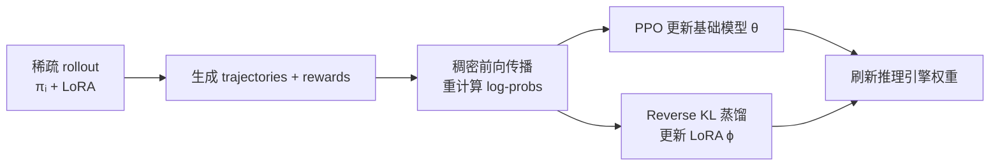

## 🧠 核心摘要 (TL;DR)
> 在 LLM 强化学习（RL）训练中，直接用稀疏注意力做 rollout 会导致 actor–policy 分布偏移，进而引发训练崩溃。DISTILLSPARSE 提出用 LoRA 在线蒸馏将稠密策略的分布对齐到稀疏采样策略，并配合奖励感知过采样与过滤，在数学推理任务（AIME24/25、AMC23、Math500）上匹配稠密 rollout 的训练效果，同时在 H200 上实现 **1.72×** 端到端加速。

## 🏷️ 元数据
- **论文标题**: Sparse Attention for Efficient LLM Reinforcement Learning
- **发表机构/会议**: ICLR 2026 Workshop (SPOT — 1st Workshop on Scaling Post-training for LLMs)
- **年份**: 2026
- **链接**: [[DistillSparse_paper|📄论文]] | 💻 Code: 暂未开源

---

## 🕸️ 知识图谱索引
- **关键词 (Keywords)**: #sparse-attention #reinforcement-learning #kv-cache #lora #llm-inference
- **前置知识 (Prerequisites)**: [[KV稀疏调研]], [[RL中的KV稀疏讨论]]
- **相关节点 (Related Notes)**: [[KvZap]], [[AttentionRes]]
- **向下延申 (Successors)**:

---

## 🎯 动机与痛点

### 现有方案的瓶颈

强化学习（RL）已成为提升 LLM 推理能力的核心驱动力（DeepSeek-R1, OpenAI o1 等），但 **rollout 生成**的高昂代价正成为扩展瓶颈：
- **长 CoT + 大批量采样**：长链推理使每条 token 的 KV-cache 加载开销以二次方速度增长；
- **rollout 主导 RL 时间**：实测中 rollout 阶段占每轮训练总时间的 **>90%**，而其他阶段（logits 重计算、策略更新）因以 prefill 模式运行，仍属 compute-bound；
- **稠密注意力的瓶颈**：稠密自回归解码每层代价包含参数计算和 KV-cache 访问，后者随 $L_\text{out}$ 平方增长；$C_\text{mem} = 2PL_\text{out} + BN(2L_\text{in}L_\text{out} + L_\text{out}^2)D$。

稀疏注意力（如 KV budget $K$ 的 block top-k）将 KV 访问的二次依赖改写为 $O(KL_\text{out})$，理论上可以打破 rollout 的 latency 瓶颈。然而作者在实验中发现——

> **问题核心**：实际可加速的稀疏注意力算法（非精确 top-k）会引入**似然偏差**，使 importance ratio $\pi_{\theta_\text{old}}(y|x) / \mu_{\theta_\text{old}}(y|x)$ 显著偏离 1，且随生成长度和稀疏程度加剧，最终导致训练崩溃或收敛到次优结果。

具体机制如下：
1. **Likelihood Bias（似然偏差）**：稀疏 rollout 策略 $\mu$ 与稠密训练策略 $\pi_{\theta_\text{old}}$ 之间的 KL 散度相较于常规 staleness 问题高出**近两个数量级**；
2. **累积效应**：每步 rollout 的近似误差沿自回归步骤累积，跨训练迭代指数级增大；
3. **长度退化**：分布偏移导致策略更新信号紊乱，response 逐渐缩短，最终崩溃。

### 现有分布对齐方案的局限性

| 方法类别 | 代表工作 | 局限性 |
|---------|---------|-------|
| 截断重要性采样 (TIS) | FlashRL, AReal, LlamaRL, IcePop | 仅在 importance ratio 接近 1 时有效；稀疏 rollout 下 ratio 严重偏离 1，TIS 失效 |
| 拒绝采样重对齐 | Jackpot (Liu et al., 2025b) | 在极端 mismatch（稀疏 rollout）下仍会崩溃；样本利用率低 |
| Speculative Decoding | TriForce (Sun et al., 2024), MagicDec (Sadhukhan et al., 2025a) | 大批量验证开销过高，RL rollout 场景不适合 |
| 稀疏 rollout + 稀疏 training | — | 回避了 mismatch，但评估仍需稠密注意力，且最终性能低于稠密基线 |

### 论文的切入点

DISTILLSPARSE 的关键洞察：**分布偏移是 RL 动态过程中持续积累的，不能事后纠正，必须主动对齐**。具体策略是：
1. **在线 LoRA 蒸馏**：让稀疏采样策略通过持续蒸馏对齐到稠密策略，而非单次后处理；
2. **奖励感知过采样 + 过滤**：在极端稀疏场景下，过采样候选 trajectories 并以奖励分数作为代理筛选"靠近稠密分布"的样本。

---

### 📚 相关工作

#### 1. 先驱/奠基工作（稀疏注意力基础）

- **H2O** (Zhang et al., ICLR 2023, arXiv:2306.14048)：首次系统研究 KV cache 中的"Heavy Hitter"现象，提出基于累积 attention score 的动态淘汰策略，在保留 20% token 时实现 29× 推理吞吐提升，是稀疏 KV inference 的奠基工作。

- **Quest** (Tang et al., ICML 2024, arXiv:2406.10774)：提出 Query-Aware Sparsity，通过追踪每个 KV cache page 的 key 的 min/max 估算 query 相关性，只加载 top-K 最重要的 page，实现 7× 延迟降低；论文目标的 token-level 稀疏方法之一。

- **ClusterKV** (Liu et al., 2025a, arXiv:2412.03213)：在语义空间中对 token 聚类后选择性加载，在 32K 上下文下以 1-2K KV budget 实现近乎无损精度，2× 延迟提升。

- **Native Sparse Attention (NSA)** (Yuan et al., 2025, arXiv:2502.11089)：DeepSeek 提出的端到端可训练稀疏注意力，结合 token 压缩和精细选择双机制，在 64K 序列上匹配甚至超越全注意力精度，是"预训练稀疏注意力"方向的代表。

#### 2. RL 训练系统与算法

- **DeepSeekMath / GRPO** (Shao et al., 2024, arXiv:2402.03300)：提出 Group Relative Policy Optimization（GRPO），以组内相对奖励规范化替代 PPO 的 critic，大幅降低内存开销，是本文 RL 训练的基础算法框架。

- **DeepSeek-R1** (DeepSeek-AI, 2025, arXiv:2501.12948)：证明纯 RL 可以涌现出复杂推理能力，引发长 CoT 推理的训练需求暴增，直接催生了本文所研究的问题。

- **DAPO** (Yu et al., 2025, arXiv:2503.14476)：开源 RL 训练系统，基于 VeRL 框架，引入 Decoupled Clip 和动态采样策略，在 Qwen2.5-32B 上 AIME 2024 达到 50 分，是本文对比的 RL 训练生态。

- **VeRL/HybridFlow** (Sheng et al., 2025, arXiv:2409.19256)：本文实验使用的 RLHF 训练框架，通过 3D-HybridEngine 实现 actor 训练与推理引擎的高效切换，1.53×–20.57× 吞吐提升。

- **SGLang** (Zheng et al., 2024, arXiv:2312.07104)：本文使用的推理引擎，支持高效结构化程序执行，通过 RadixAttention 实现 KV cache 复用，高吞吐服务基础设施。

#### 3. 分布对齐方法

- **Jackpot** (Liu et al., 2025b)：提出 Optimal Budgeted Rejection Sampling（OBRS），通过随机拒绝最小化 KL 散度并保持计算预算，是本文主要对比的分布对齐基线。在稀疏 rollout 极端 mismatch 下仍会崩溃。

- **Stabilizing RL with LLMs** (Zheng et al., 2025a, arXiv:2512.01374)：从理论上分析 token-level surrogate 目标的合理性，指出 importance sampling correction 对稳定 RL 训练的必要性，揭示了为何传统 IS 在大 ratio 偏移时失效。

- **M2PO/Prosperity Before Collapse** (Zheng et al., 2025b)：研究 stale data 在 RL 训练中的影响，提出二阶矩信任区域约束，但本文发现稀疏 rollout 的 mismatch 远超 staleness 问题（KL 散度高出近 100×）。

- **IMPALA** (Espeholt et al., 2018, arXiv:1802.01561)：actor-learner 分离式分布式 RL 的奠基工作，最早系统研究 off-policy actor–policy 分布偏移问题，引入截断 IS 方法。

#### 4. Rollout 加速方法

- **TriForce** (Sun et al., 2024, arXiv:2404.11912)：层次化 speculative decoding，用稀疏 KV 检索做 draft，实现 2.31× 加速，但大批量验证开销使其不适用于 RL rollout 场景。

- **MagicDec** (Sadhukhan et al., 2025a, arXiv:2408.11049)：在 large-batch 高吞吐场景下结合 speculative decoding 与稀疏 KV 草稿，Llama-3.1-8B 上实现 2.51× 加速，但 RL 大批量验证同样是瓶颈。

- **Kinetics** (Sadhukhan et al., 2025b, arXiv:2506.05333)：系统分析 test-time scaling 规律，发现注意力是主要开销而非参数量，提出稀疏注意力是解锁更好 inference scaling 的关键，是本文动机的直接理论支撑。

- **PipelineRL** (Piché et al., 2025, arXiv:2509.19128)：通过异步流水线并发数据生成与模型训练，实现约 2× 更快的收敛，但 rollout 本身的高资源占用没有解决。

- **APRIL** (Zhou et al., 2025, arXiv:2509.18521)：过采样 rollout 候选并在收集足够响应后截断，回收未完成的响应，实现 22.5% 吞吐提升，与本文的过采样过滤思路互补。

- **RL Survey** (Zhang et al., 2025, arXiv:2509.08827)：全面综述 LLM 推理 RL 领域，覆盖算法、训练资源和基础设施挑战，是本领域的参考综述。

---

## ⚙️ 核心设计与机制

### 架构创新：DISTILLSPARSE 框架

DISTILLSPARSE 的核心思路是：**不依赖事后纠正，而是主动在训练循环中桥接稀疏 rollout 与稠密策略之间的分布差距**。框架由两个相互配合的组件构成：

### 关键技术点 1：LoRA 在线蒸馏（On-Policy LoRA Distillation）

**问题起源**：稀疏 rollout 策略 $\mu = \pi^\text{sparse}_{\theta, \phi}$ 与稠密策略 $\pi_\theta^\text{dense}$ 之间的 KL 散度在训练中持续积累，最终爆炸。传统 IS 纠正仅在 ratio 接近 1 时有效，而稀疏注意力在长序列下 ratio 严重偏离 1。

**方案**：引入参数为 $\phi$ 的 LoRA 模块，构建稀疏注意力策略 $\pi^\text{sparse}_{\theta,\phi}$，通过 **Reverse KL 蒸馏**持续向稠密策略对齐：

$$\mathcal{L}_\text{LoRA}(\phi) = \mathbb{E}_{x,y} \left[ \text{KL}\!\left(\pi^\text{sparse}_{\theta,\phi}(\cdot|x,y_{<t}) \,\|\, \pi^\text{dense}_\theta(\cdot|x,y_{<t})\right) \right]$$

完整的策略更新算法（Algorithm 1）为：

1. 构建 $\pi^\text{dense}_\theta$（全注意力）和 $\pi^\text{sparse}_{\theta,\phi}$（稀疏注意力 + LoRA）
2. 从 $\pi^\text{sparse}_{\theta,\phi}$ 采样 rollout $y$，计算奖励和 advantage
3. 用稠密模型重计算 token log-probs：$\log \pi^\text{dense}_\theta(y_t | x, y_{<t})$
4. 用重计算的稠密 log-probs 更新基础模型 $\theta$（PPO loss）
5. 冻结 $\theta$，用 Reverse KL 更新 LoRA $\phi$
6. 刷新推理引擎中的 $\theta + \phi$

**工程设计亮点**：
- 稠密模型的 log-probs（step 3）**复用**于 PPO 更新和蒸馏损失，无额外推理开销；
- LoRA 训练只需对少量参数做 backward，额外内存和计算开销极小；
- 通过 FSDP 和 SGLang 推理引擎解耦训练与推理的权重状态；
- Flash Sparse Attention（Yan et al., 2025）用于高效的稀疏注意力训练；PEFT 用于 LoRA 适配。

### 关键技术点 2：奖励感知过采样与过滤（Parallel Sampling and Filtering）

**适用场景**：当稀疏度极高（如 KV budget 仅 512，对应 7%–10% sparsity ratio）时，即使有 LoRA 蒸馏，单次采样仍可能产生过多偏离稠密分布的 trajectories。

**关键观察**：作者发现，**靠近稠密策略分布的 trajectories 往往具有更高奖励**（两者高度相关）。因此，可以用奖励分数作为"密度代理"来筛选 trajectories，而无需昂贵的稠密 log-prob 计算。

**具体做法**：
- 对每个 prompt $x$，生成 $M$ 个候选 trajectory（$M > n$，$n$ 为正常采样数）；
- 选取 top-$n$ 奖励最高的子集 $\omega(x)$ 参与策略更新：

$$\omega(x) \triangleq \left\{ y_i \in \Omega(x) : \hat{A}_i \in \text{TopK}\!\left(\{\hat{A}_j\}_{y_j \in \Omega(x)}, n\right) \right\}$$

- 目标函数改为在 $\omega$ 上计算：

$$\mathcal{L}(\theta, \omega) = \frac{1}{n} \sum_{y_i \in \omega} \frac{1}{|y_i|} \sum_{t=1}^{|y_i|} \ell_\text{clip}(r_{i,t}(\theta), \hat{A}_{i,t})$$

**性能收益**：
- 随 $M$ 从 8 增大到 12、16，AIME25 性能持续提升；
- 接受率（Dense-model acceptance rate）随过采样倍数增大而上升，表明过采样确实改善了 trajectories 的分布贴近度；
- 稀疏注意力的"免费午餐"：增大 $M$ 相比同等稠密 rollout 的计算代价更低，因为 KV-cache 加载代价已被大幅缩减。

### 关键技术点 3：Block Top-K 稀疏注意力

本文采用 **Block Top-K 注意力**，页面大小 16，按 top-k 页面选择 KV budget，通过 **Vortex torch**（Chen, 2025）实现高效的稀疏 rollout 加速。稀疏解码的代价从稠密的 $O(L_\text{out}^2)$ 降至 $O(KL_\text{out})$，其中：

$$H = (2L_\text{in} + L_\text{dense})L_\text{dense} + 2K(L_\text{out} - L_\text{dense})^+, \quad L_\text{dense} = \min(L_\text{out}, K - L_\text{in})$$

当 rollout 长度达到 16K 时，稀疏 rollout 的计算代价相比稠密降低 **>2×**。

### 核心公式总结

**重要性比率（Importance Ratio）**：
$$r_{i,t}(\theta) = \frac{\pi_{\theta}(y_t | x, y_{<t})}{\pi_{\theta_\text{old}}^\text{dense}(y_t | x, y_{<t})}$$

**Token-level IS 近似（原始 RL 目标）**：
$$\mathcal{L}_\text{IS}^\text{token}(\theta) = \mathbb{E} \left[ \sum_{t=1}^{|y|} \text{SG}\!\left(\frac{\pi_{\theta_\text{old}}(y_t|x,y_{<t})}{\mu(y_t|x,y_{<t})}\right) \cdot \ell_\text{clip}(r_t(\theta), A_t) \right]$$

**联合训练损失**：
$$\mathcal{L}_\text{joint} = \mathcal{L}_\text{PPO}(\theta) + \lambda \mathcal{L}_\text{KL}(\phi)$$

---

## 📊 实验与性能评价

### 实验设置

- **基础模型**：Qwen3-4B-Base 和 Qwen3-8B-Base（Yang et al., 2025）
- **训练数据**：先在 DeepScaleR（Luo et al., 2025）上 warmup 200 步，再在 Polaris（An et al., 2025）数据集上进行主要训练（53K 训练样本 for 4B，32K for 8B）
- **稀疏配置**：Block size 16，top-k blocks 数量 24（7% sparsity）或 32（10% sparsity），KV budget 512
- **生成长度**：4B 模型 12K，8B 模型 16K
- **硬件**：4B 模型用 2xDGX H100，8B 模型用 4xDGX H100，各训练约 5-6 天
- **训练框架**：VeRL (FSDP) + SGLang 推理引擎 + Vortex torch 稀疏算子

### 主要实验结果（Table 1）

| 模型/配置 | GSM8K | MATH500 | AMC23 (M@4) | AIME24 (M@4) | AIME25 (M@4) |
|---------|-------|---------|------------|-------------|-------------|
| **4B, Block 16×24 (7% sparsity)** | | | | | |
| Dense Rollout（稠密基线） | 0.933 | 0.848 | 0.666 | 0.302 | 0.258 |
| Sparse Rollout Dense Training | 0.928 | 0.830 | 0.627 | 0.275 | 0.236 |
| Sparse Rollout Sparse Training | 0.928 | 0.835 | 0.533 | 0.281 | 0.233 |
| **DISTILLSPARSE (LoRA Only)** | **0.936** | **0.851** | **0.675** | **0.290** | **0.250** |
| DISTILLSPARSE (w/ Oversampling) | 0.930 | 0.838 | 0.666 | 0.288 | 0.260 |
| **4B, Block 16×32 (10% sparsity)** | | | | | |
| Sparse Rollout Dense Training | 0.933 | 0.835 | 0.636 | 0.267 | 0.263 |
| **DISTILLSPARSE** | **0.933** | **0.849** | **0.666** | **0.310** | **0.267** |
| **8B, Block 16×32** | | | | | |
| Dense Rollout（稠密基线） | 0.930 | 0.837 | 0.666 | 0.321 | 0.231 |
| Sparse Rollout Dense Training | 0.940 | 0.823 | 0.630 | 0.273 | 0.198 |
| **DISTILLSPARSE** | **0.931** | **0.836** | **0.666** | **0.323** | **0.229** |

核心结论：在所有训练失败或退化的场景中，DISTILLSPARSE 都能恢复到与稠密基线相当的性能。

### 效率分析（Figure 7）

三种训练流程的时间开销对比（16K 生成长度，H200）：

| 阶段 | 稠密 rollout | 稀疏 rollout | DISTILLSPARSE |
|------|------------|------------|--------------|
| Rollout 时间 | ~90% | ~45%（降低 >2×） | ~45% |
| 稠密更新 | ~10% | ~10% | ~16%（+55%，蒸馏额外开销） |
| **端到端** | 1× | 2×+ | **1.72×** |

**端到端加速 1.72×**：LoRA 蒸馏带来约 55% 的额外更新开销，但稀疏 rollout 的加速使总体仍有显著收益。

### Sparse Model 质量提升（Table 2 副产品）

DISTILLSPARSE 作为副产品还带来了更强的**稀疏推理模型**。以稀疏注意力做推理时：

| 模型/方法（4B, 16×24, 12K） | AIME25 M@4 | AIME25 P@4 | AIME24 M@4 |
|--------------------------|-----------|-----------|-----------|
| Dense Rollout Dense Training (Sparse eval) | 0.181 | 0.231 | 0.235 |
| Sparse Rollout Sparse Training | 0.167 | 0.231 | 0.235 |
| **DISTILLSPARSE** | **0.217** | **0.292** | **0.240** |

Reverse KL 蒸馏使稀疏模型的 AIME25 Pass@4 从 0.231 提升至 0.292，说明蒸馏过程显著改善了稀疏模型本身的质量。

### 过采样的普适性（Figure 6）

奖励感知过采样不仅适用于稀疏 rollout 场景，在"弱 rollout 模型 + 强训练模型"的跨模型场景中（Qwen3-1.7B rollout，Qwen3-4B training）同样有效：过采样从 12→16→24 持续提升稳定性，训练稳定期从 300 步延伸到 550+ 步。

### 局限性 (Limitations)

- **LoRA 额外开销**：蒸馏使稠密更新的时间增加约 55%，在超短生成场景下收益更小；
- **预热依赖**：受计算资源限制，无法直接训练 32K 平均输出长度的 thinking 模型，实验用 warmup 检查点代替；
- **规模上限**：单次训练 5-6 天（H100），大规模扩展成本高；
- **参数敏感性**：过采样倍数 $M$、KV budget $K$ 的最优选择依赖任务，需要实验调优。

---

## 💡 启发与我的想法

### 可借鉴之处

1. **"在线对齐"优于"事后纠正"**：DISTILLSPARSE 的核心洞察是把分布对齐嵌入 RL 训练循环，而非用后处理补救。这与 KV 稀疏调研中描述的"近似错误累积"问题完全一致——训练时的稀疏误差会在多步更新中放大，必须主动桥接。

2. **奖励作为分布代理**：用奖励分数筛选靠近稠密分布的 trajectories 是一个巧妙的"免费信号"利用——奖励本来就要计算，而高奖励与高接受率的相关性意味着不需要额外的稠密 log-prob 评估。

3. **LoRA 的最小开销原则**：在训练中增加一个 LoRA 模块（参数量极少）来承载分布对齐，不改变主干模型的训练目标，是一种非常"外科手术"式的干预。可借鉴到其他需要双策略联合训练的场景（如 speculative decoding 的 draft model 训练）。

4. **稀疏 rollout 的另一种路径**：本文的路径是"稀疏采样 + 稠密更新"，不是"训练出一个原生稀疏模型"。这保留了稠密训练目标的全部语义，仅在采样阶段节省计算——更安全，也更易于集成到现有 RL 系统。

### 改进空间

1. **更智能的过采样策略**：当前过采样倍数 $M$ 是固定的，可以探索基于当前 KL 散度自适应地调整 $M$（KL 高时多采样，KL 低时减少过采样）。

2. **渐进式稀疏度调度**：训练初期用较低稀疏度（较大 KV budget），随着 LoRA 逐渐对齐分布后再逐步提高稀疏度，可能获得更好的稳定性与效率平衡。

3. **与 Kinetics 的结合**：Kinetics（Sadhukhan et al., 2025b）指出注意力是 test-time scaling 的主要瓶颈，而 DISTILLSPARSE 解决了 RL 训练阶段稀疏注意力的稳定性问题，两者可以组合：用 DISTILLSPARSE 训练的稀疏模型作为 Kinetics scaling 的基础设施。

4. **推广到其他 rollout 加速**：过采样 + 奖励过滤的思路可以推广到 quantized rollout（FlashRL）或异步 rollout（PipelineRL, APRIL）场景，只要存在 rollout model ≠ training model 的分布偏移。

5. **Block size 自适应**：当前 block size 固定为 16，可以探索 query-dependent dynamic block selection（类似 Quest 的 page-level 动态选择），在 DISTILLSPARSE 框架内进一步提高稀疏质量。

### 下一步 Action

- [ ] 追踪 DISTILLSPARSE 是否有后续开源代码发布（当前暂未开源）
- [ ] 阅读 Kinetics (arXiv:2506.05333) 了解稀疏注意力与 test-time scaling 的系统性分析
- [ ] 调研 Jackpot (Optimal Budgeted Rejection Sampling) 的实现细节，与 DISTILLSPARSE 的过滤策略作对比
- [ ] 关注 Flash Sparse Attention (Yan et al., 2025, arXiv:2508.18224) 的训练效率数据

