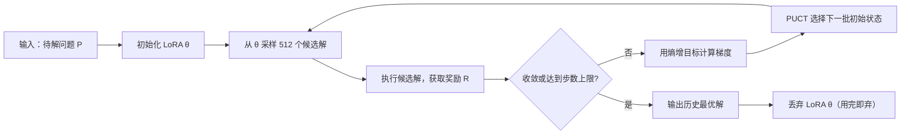

## 🧠 核心摘要 (TL;DR)

> 传统 LLM 推理时权重冻结，只能「回忆」训练知识。TTT-Discover 提出在推理阶段针对**单一问题**用强化学习直接更新模型权重，配合熵增目标函数（鼓励探索极端高回报区域）和 PUCT 树搜索，在数学发现、GPU Kernel 工程、算法竞赛、生物信息分析四个领域达到新 SOTA，但代价是每题约 500 美元的算力成本与不可逆的过拟合。

## 🏷️ 元数据

- **论文标题**: Learning to Discover at Test Time
- **发表机构/会议**: arXiv（Stanford / UCSD / NVIDIA / University of Washington 联合）
- **年份**: 2026（提交 2026-01-22，修订 2026-02-05）
- **链接**: [[TTT-Discover_paper|📄论文]] | [💻 Code](https://github.com/test-time-training/discover)

---

## 🕸️ 知识图谱索引

- **关键词 (Keywords)**: #test-time-training #reinforcement-learning #scientific-discovery #llm-optimization #entropic-objective
- **前置知识 (Prerequisites)**: [[RL中的KV稀疏讨论]]
- **相关节点 (Related Notes)**: [[KV稀疏调研]]

---

## 🎯 动机与痛点

### 现有方案的瓶颈

当前 AI 模型的工作范式可以类比为一个「高考学霸」：预训练阶段大量读书、将知识编码进权重；推理阶段靠回忆与逻辑推演作答。即便 OpenAI o1 这类「会思考」的模型，也只是在推理时延长了 Chain-of-Thought（打草稿），**模型权重本身始终是冻结的**。

这一范式带来了根本性的天花板：面对那些需要真正创新性发现的问题（如数学中的极值问题、工程中的极限优化），固化权重的模型无法「进化」出全新的解题策略，只能在已知知识空间内搜索。

具体痛点包括：

- **搜索空间有限**：CoT / 蒙特卡洛树搜索（MCTS）在程序空间中探索，但模型「提议」能力受限于训练时见过的策略分布
- **平均性能优化**：标准 RL 训练最大化期望奖励，偏向「稳健」，会牺牲极端高回报的探索机会
- **无法适应极端新颖问题**：对于训练分布之外的开放问题（如 Erdős 猜想、极速 GPU Kernel），冻结模型往往停留在已知最优解附近

### 论文的切入点

TTT-Discover 的核心洞见是：**对于只需回答一次的问题，我们不需要保留模型的通用能力**。只要最终找到那个正确答案，模型可以为此牺牲一切——哪怕因严重过拟合而「废掉」自己的其他能力也无所谓，用完即弃。

这是一种极度激进但极具针对性的策略：
1. **推理时实时微调**：针对当前问题，在推理阶段通过强化学习直接修改模型参数（LoRA 适配器）
2. **赌徒目标函数**：修改 RL 目标，不再最大化期望奖励，而是鼓励模型探索极端高回报区域
3. **用完即弃**：这个针对特定问题进化出的「专用模型」解完题即丢弃，不需要保留通用能力

### 相关工作

#### 🔬 先驱/奠基工作

| 论文 | 核心贡献 | 与本文关系 |
|------|---------|-----------|
| Sun et al. (2020) "Test-Time Training with Self-Supervision for Generalization under Distribution Shifts" ICML 2020 [arXiv:1909.13231] | 最早提出 TTT 概念：推理时用自监督损失微调模型，应对分布偏移 | TTT-Discover 的奠基工作，TTT 概念的来源 |
| Hardt & Sun (2023) "Test-Time Training on Nearest Neighbors for Large Language Models" [arXiv:2305.18466] | 在 LLM 上应用 TTT：检索 20 个最近邻，单步梯度更新，在 20+ 语言建模任务中显著提升 | TTT 方法迁移到 LLM 的先驱，与本文共享作者 Yu Sun |
| Schulman et al. (2017) "Proximal Policy Optimization Algorithms" [arXiv:1707.06347] | PPO：通过裁剪替代目标实现高效的 on-policy 策略梯度优化 | TTT-Discover 的 RL 训练基础 |
| Hu et al. (2021) "LoRA: Low-Rank Adaptation of Large Language Models" [arXiv:2106.09685] | LoRA：冻结预训练权重，注入低秩矩阵实现参数高效微调 | TTT-Discover 用 LoRA（rank=32）在推理时更新参数 |
| DeepSeek-AI (2025) "DeepSeek-R1" [arXiv:2501.12948] | 纯强化学习激励 LLM 推理能力，无需人工标注推理轨迹 | 展示了 RL 训练 LLM 推理的可行性，TTT-Discover 用类似思路但应用于测试时 |

#### ⚔️ 直接对比方法

| 论文 | 方法特点 | 与本文差异 |
|------|---------|-----------|
| Novikov et al. (2025) "AlphaEvolve: a coding agent for scientific and algorithmic discovery" [arXiv:2506.13131] | Google DeepMind 的 LLM + 进化搜索组合，已在 Gemini 上验证，发现了 56 年来 Strassen 矩阵乘法首个改进 | AlphaEvolve 使用**冻结**的 LLM 提议 + 进化筛选；TTT-Discover **更新**模型权重 |
| Georgiev et al. (2025) "Mathematical Exploration and Discovery at Scale" [arXiv:2511.02864] | 在 67 道数学问题上测试 AlphaEvolve，与 Terence Tao 合作验证 | 本文的部分对比基线（Erdős 问题上 AlphaEvolve 的成绩是 TTT-Discover 的参照） |
| Lange et al. (2025) "ShinkaEvolve: Towards Open-Ended and Sample-Efficient Program Evolution" [arXiv:2509.19349] | 引入父代采样、代码新颖性拒绝采样和多臂老虎机 LLM 组合选择；150 样本即发现新圆形堆积解 | 同为进化搜索改进，但未做权重更新；TTT-Discover 将训练与搜索统一 |
| Surina et al. (2025) "Algorithm Discovery with LLMs: Evolutionary Search Meets Reinforcement Learning" [arXiv:2504.05108] | 进化搜索 + RL 微调组合，用 RL 持续改进 LLM 的提议能力，在组合优化任务上验证 | 与 TTT-Discover 最接近的并行工作，但目标是跨任务泛化而非单题极限 |

#### 🚀 Follow-up / 并行工作

| 论文 | 核心贡献 |
|------|---------|
| Wang et al. (2025) "ThetaEvolve: Test-time Learning on Open Problems" [arXiv:2511.23473] | 小模型（DeepSeek-R1-0528-Qwen3-8B）结合 in-context learning + RL 在开放问题上取得新最优，首次展示小模型 TTT 的可行性 |
| Phan et al. (2025) "MiGrATe: Mixed-Policy GRPO for Adaptation at Test-Time" [arXiv:2508.08641] | 混合 on-policy + off-policy 的 GRPO，在词搜索、分子优化和 ARC 任务上在线 TTT 自适应 |
| Jiang et al. (2026) "DeltaEvolve: Accelerating Scientific Discovery through Momentum-Driven Evolution" [arXiv:2602.02919] | 引入动量驱动的进化策略，加速搜索收敛 |


## ⚙️ 核心设计与机制

### 整体框架：推理时的强化学习循环

TTT-Discover 的核心是将训练与推理合并为一个在线循环。对于一道给定的问题 $P$，系统执行以下步骤：

```
while not converged:
    1. 从当前 θ 采样一批候选解 {a₁, a₂, ..., aₙ}
    2. 执行每个候选解，获得奖励 {R(a₁), R(a₂), ..., R(aₙ)}
    3. 用强化学习梯度更新 LoRA 参数 θ
    4. 记录历史最优解
return best_solution
```

关键设计选择：**使用 LoRA（rank=32）作为可更新的参数**，底层 gpt-oss-120b 冻结。每次训练执行 50 步，每步 512 次 rollout（8 组 × 64 个并行样本）。

### 关键技术点 1：熵增目标函数（Entropic Objective）

标准 RL 最大化期望奖励 $\mathbb{E}[R]$，这在多任务场景下是合理的——它鼓励稳健的平均表现。但对于**发现型**问题，我们只关心是否存在**至少一个**极端高回报解，不需要「所有解都不错」。

TTT-Discover 提出了熵增目标函数（Entropic Utility Objective）：

$$J_\beta(\theta) = \mathbb{E}_s\left[\log \mathbb{E}_a\left[e^{\beta(s) \cdot R(s,a)}\right]\right]$$

- 当 $\beta \to 0$ 时，$J_\beta \to \mathbb{E}[R]$（退化为普通期望奖励）
- 当 $\beta \to \infty$ 时，$J_\beta \to \max_a R(s,a)$（趋向最大化最优解）

**实际实现**：$\beta(s)$ 是自适应的，针对每个初始状态 $s$ 独立设置，同时加 KL 散度约束避免策略崩塌。这个目标函数的核心效果是：**它给高奖励样本极大的梯度权重，驱动模型向极端区域探索**，而不是均匀拟合所有样本。

**消融实验**（TriMul GPU Kernel 任务）：
- 有熵增目标：1,203 μs
- 去掉熵增目标（退化为普通期望 RL）：1,985 μs
- 差距 ~40%，说明熵增目标是核心贡献之一

### 关键技术点 2：PUCT 启发的状态选择与复用

在强化学习中，「从哪个初始状态开始 rollout」非常重要。论文借鉴了 AlphaGo 中的 PUCT（Predictor + Upper Confidence Trees）算法，设计了一个得分函数：

$$\text{Score}(s) = Q(s) + c \cdot P(s) \cdot \frac{\sqrt{1 + T}}{1 + n(s)}$$

各项含义：
- $Q(s)$：**该状态下子节点的最大奖励**（注意：不是均值！）——鼓励向高奖励区域深挖
- $P(s)$：基于历史奖励的排名先验，优先从表现好的分支继续
- $\sqrt{1+T}/(1+n(s))$：时间 $T$ 增长时鼓励探索；访问次数 $n(s)$ 多时降低优先级（UCB 项）
- $c$：探索系数，超参数

**核心设计哲学**：$Q(s)$ 取最大值而非均值，意味着「一旦某条路径产生过一个极高分解，就持续深挖这条路」。这与普通 MCTS 的均值 $Q$ 根本不同——普通 MCTS 追求稳健，TTT-Discover 追求极限。

**消融实验**：去掉 PUCT 复用，TriMul 性能从 1,161 μs 退化到 5,274 μs（H100，~4.5 倍差距），说明状态复用策略至关重要。

### 关键技术点 3：奖励信号设计——连续奖励的硬约束

TTT-Discover 有一个明确的适用前提：**问题必须具有连续可微分的奖励信号**，即能够精确量化「越好越坏」。论文覆盖的四个领域都满足这一条件：

| 任务领域 | 奖励信号 | 方向 |
|---------|---------|------|
| 数学（Erdős 重叠问题） | 目标函数值 | 越小越好 |
| GPU Kernel 优化（TriMul） | 实际运行时间（μs） | 越快越好 |
| 算法竞赛（AtCoder） | 在线评测得分 | 越高越好 |
| 生物信息（单细胞去噪） | 相关系数（0-1） | 越接近 1 越好 |

这个「连续奖励」的前提是 TTT-Discover 的核心局限之一——它**无法应用于只有离散对错的任务**（如多选题、布尔判断题），因为单一的 0/1 信号无法驱动梯度有效更新。

### 架构实现细节

```
模型：gpt-oss-120b（开源，由 OpenAI 发布）
适配器：LoRA，rank=32
训练轮数：50 steps
每步 rollouts：512（8 groups × 64）
上下文窗口：32,768 tokens
prompt + thinking budget：26,000 tokens
计算成本：约 $500/问题（在 Tinker 集群上）
```

整个系统的流程可以用以下 Mermaid 图表示：




## 📊 实验与性能评价

### 对比基线 (Baseline)

所有实验基于开源的 **gpt-oss-120b**（OpenAI 发布的 120B 参数开源模型），与 AlphaEvolve 等使用 Gemini 的专有模型对比，体现了 TTT-Discover 在开源生态中的贡献。

### 实验结果汇总

#### 数学发现

**任务一：Erdős 最小重叠问题（Erdős Minimum Overlap Problem）**

Erdős 最小重叠问题是组合数学中的一个经典开放问题。TTT-Discover 将已知最优值从 AlphaEvolve 的 0.380924 推进到 **0.380876**（数值越小越好）。

| 方法 | 结果 |
|------|------|
| 人类已知最优（历史） | ~0.381（约） |
| AlphaEvolve | 0.380924 |
| **TTT-Discover** | **0.380876** |

**任务二：自相关不等式（AC1 Autocorrelation Inequality）**

| 方法 | 结果 |
|------|------|
| 此前最优 | 1.50314 |
| **TTT-Discover** | **1.50287** |

两项数学结果均经过人类专家（数学家）独立验证。

#### GPU Kernel 工程（TriMul 三角矩阵乘法）

TriMul 是蛋白质结构预测（AlphaFold）中的核心算子，手工优化难度极高。

| 硬件 | 最佳人类成绩 | **TTT-Discover** | 提升幅度 |
|------|------------|-----------------|---------|
| A100 | 4,531 μs | **2,198 μs** | ~50% 加速 |
| H100 | 1,371 μs | **1,161 μs** | ~15% 加速 |

这是本文最令人印象深刻的结果——TTT-Discover 找到的 GPU Kernel 在 A100 上比最优人类实现快了整整一倍。

#### 算法竞赛（AtCoder 在线评测）

AtCoder Heuristic Contest（AHC）是一种接近工业界问题的优化竞赛，评分连续且精确，适合 RL 优化。

| 竞赛场次 | 人类第一名 | **TTT-Discover** | 排名（与人类对比）|
|---------|----------|-----------------|----------------|
| ahc039 | 566,997 | **567,062** | 超越人类第一 |
| ahc058 | 847,674,723 | **848,414,228** | 第一名（与人类共列） |

#### 生物信息（单细胞 RNA 去噪）

任务是从单细胞测序数据中恢复真实基因表达。TTT-Discover 自动改进了去噪算法。

| 数据集 | MAGIC 基线 | **TTT-Discover** |
|--------|-----------|-----------------|
| PBMC | 0.64 | **0.71** |
| Tabula | 0.64 | **0.73** |

MAGIC（van Dijk et al., 2018, Cell 176(3)）是该领域的经典基线算法。

### 局限性 (Limitations)

论文本身坦承了三大局限：

1. **极高算力成本**：每道题约 **$500 美元**（Tinker 集群上），512 次并行 rollout × 50 步训练。这使得它只适合「真正值得如此投入的问题」，而非日常应用
2. **不可逆过拟合**：训练完成的 LoRA 适配器严重过拟合于当前问题，推理结束后必须丢弃。这与通常追求通用性的 RL 训练范式截然相反
3. **连续奖励信号依赖**：方法严格依赖能够精确量化的连续奖励信号。对于只有「对/错」二值反馈的任务（如开放性问答、逻辑判断），当前框架无法直接应用

---

## 💡 启发与我的想法

### 核心概念的本质

如果把现在的 AI 模型比作一个学霸，TTT-Discover 代表了一种截然不同的范式转变：它把模型从「参加全国统一考试的学霸」变成了「为攻克某一道题而专门进化出来的特种兵」。

传统范式：预训练 → 固化权重 → 推理时「回忆」+「推演」（即便 o1 式 CoT 也只是多打草稿，权重锁死）

TTT-Discover 范式：预训练 → 固化底座 → **推理时针对单问题 RL 微调** → 极限探索 → 用完丢弃

这种「赌徒心态」——不再追求稳健，而是鼓励探索极端高回报区域——在学术上形式化为熵增目标函数，在工程上则体现为每题 500 美元的算力投入。

### 与用户思考的呼应：「偏科生」问题与解法

正如用户所观察到的：**这个模型确实是一个「偏科生」**。TTT-Discover 的设计哲学明确说明——它就是为了单点突破而生的，解完题就可以丢掉。这反而解放了设计空间：不必担心灾难性遗忘，不必维持通用能力，一切资源都服务于这一道题。

**用户提出了一个深刻问题**：「有没有可能给他再外挂一个模型用来解决最基本的逻辑理解？」

这个想法有其价值，但需要区分两种架构方向：

- **方案 A：双模型并行**——保留一个冻结的「通用底座」专门处理基础逻辑，同时让 TTT-Discover 模型专攻特定任务。两者通过某种路由机制协作。这类似于 MoE（专家混合）的思路，但粒度更粗
- **方案 B：分层 LoRA**——更底层的 LoRA 层负责维持通用理解能力（更新幅度受限），更高层的 LoRA 层负责任务特异性探索（允许剧烈更新）。通过不同的学习率和 KL 约束实现层次化偏科

目前 TTT-Discover 选择了更激进的做法：完全不考虑通用性，因为任务设定本就是「用完即弃」。

### 奖励信号的本质问题：从离散到连续

**用户的核心疑问**：对于复杂问题（P=NP、黎曼猜想），如何给 RL 一个合理的 reward 信号？人类数学家在真正解决之前也不确定某条路能否走到底。

这触及了 RL 中一个根本性难题——**稀疏奖励问题**（Sparse Reward Problem）。

现有的思路可以分几个方向：

**1. 代理奖励（Proxy Reward）**：用可以量化的子目标代替最终目标。例如对于黎曼猜想，可以设计「零点与实轴的最小距离」作为连续奖励——接近 1/2 线则奖励增加。这是当前主流做法，但代理奖励可能导致 reward hacking（用奇技淫巧刷分而非真正解题）

**2. 过程奖励模型（PRM，Process Reward Model）**：训练一个独立的奖励模型，对推理过程中的每一步给出中间反馈，而不仅仅依赖最终结果。这是 OpenAI、DeepMind 等机构目前积极研究的方向

**3. 仿真环境**：正如用户所想，「给它建立仿真或与现实世界交互的能力，自己在空间里求解」。这实际上是把问题转化为强化学习的经典设定——用模拟环境给出反馈信号。TTT-Discover 的 GPU Kernel 实验中，「实际运行时间」本质上就是真实环境的直接反馈，这正是它成功的关键

**4. 保留基础能力的约束 RL**：用户担心「拓展能力边界时不能丢弃最基本的数学推理能力」。这对应 KL 散度约束——TTT-Discover 已经部分实现了这一点（$\beta(s)$ 受 KL 约束），但它只约束到初始参数附近，不区分「基础能力」和「任务特异性能力」

### 可借鉴之处

1. **目标函数的设计思想**：熵增目标是一个通用工具——任何「我只关心最好的那个解」的场景都可以用这个目标替代期望奖励，包括工程优化、药物分子设计等
2. **PUCT 的 max-Q 设计**：在搜索树中用最大值而非均值作为 $Q(s)$，这一思想可以迁移到任何需要「极限探索」而非「稳健探索」的场景
3. **LoRA 作为推理时适配器**：将 LoRA 的角色从「训练效率工具」扩展为「推理时可插拔的任务适配器」，这为未来的 AI 代理架构提供了新的设计思路

### 改进空间

- **[ ] 分层约束 LoRA**：探索不同层次的 LoRA 使用不同的 KL 约束强度，底层保护通用能力，顶层允许极端偏科
- **[ ] 成本优化**：当前 $500/题的成本主要来自 512 次并行 rollout 和 50 训练步骤，探索自适应提前停止策略能否大幅降低成本
- **[ ] 混合奖励信号**：对于只有离散对错的任务，结合 PRM（Process Reward Model）提供中间过程信号，扩展适用范围
- **[ ] 「元 TTT」**：能否先用若干历史问题做一轮 TTT-Discover 训练，让模型「学会快速偏科」，从而降低每道新题的 TTT 成本？（类似 MAML 的元学习思路）


