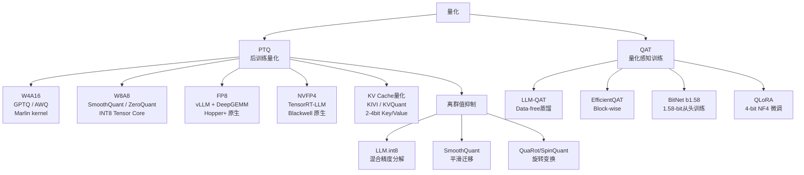

## 🧠 核心摘要 (TL;DR)

> 量化是一种有损压缩手段，通过将模型权重、激活和 KV Cache 从高精度浮点（FP32/BF16/FP16）映射到低比特表示（INT8/FP8/INT4/FP4），在推理侧实现显存节约、吞吐提升和通信量降低。核心难点是离群值（outlier）导致量化误差激增，解决路径从混合精度分解（LLM.int8()）、激活平滑迁移（SmoothQuant）到旋转变换消除离群值（QuaRot/SpinQuant）不断演进。本文系统覆盖量化原理、粒度选择、权重/激活/KV Cache 的量化差异、NVIDIA FP4 硬件规格、工程算子融合、训练时量化、精度验证、混合精度回退及伪量化等 10 个核心问题。

---

## 🕸️ 知识图谱索引

- **关键词 (Keywords)**: #量化 #quant #fp4 #fp8 #kv-cache #qat #混合精度
- **相关节点 (Related Notes)**: [[KV稀疏调研]], [[KvZap]], [[AttentionRes]]

---

## 引言

大规模语言模型（LLM）的参数量动辄数百亿，直接以 BF16/FP16 精度部署对显存、带宽和通信开销都提出了极高要求。量化（Quantization）作为一种有损压缩手段，目标是在精度损失可接受的前提下，将数值表示压缩到更低比特宽度，从而：

1. **节省显存**：INT4 权重相比 FP16 可节省 4× 存储
2. **加速推理**：Tensor Core 对低精度 GEMM 有原生加速（INT8、FP8、FP4）
3. **降低通信量**：分布式推理中张量并行的 All-Reduce 通信量与精度成正比

但压缩要解决离群点问题，让压缩比较靠谱，不丢太多精度；并且还要解决量化与反量化本身的计算 overhead，所以需要写融合算子，充分利用 GPU 的资源和设计。

本文围绕 10 个核心问题展开，涵盖量化的数学原理、硬件约束、工程实现，以及主流方法的横向对比。

---

## § 1  量化是什么：原理、难点与数学基础（问题 1）

### 1.1 量化的数学定义

量化本质上是一个映射：将实数域（或高精度浮点域）$\mathbb{R}$ 映射到有限的低精度离散集合 $\mathcal{Q}$。

**均匀量化（Uniform Quantization）** 是最常见的形式：

$$
q = \text{clamp}\left(\text{round}\left(\frac{x}{s}\right) + z,\ q_{\min},\ q_{\max}\right)
$$

其中：
- $s$（scale）：缩放因子，控制量化步长 $\Delta = s$
- $z$（zero-point）：偏移量，对称量化时 $z=0$
- $q_{\min}, q_{\max}$：量化范围，例如 INT8 为 $[-128, 127]$

反量化（Dequantization）：

$$
\hat{x} = s \cdot (q - z)
$$

量化误差：$\epsilon = x - \hat{x}$，其 MSE 为：

$$
\mathbb{E}[\epsilon^2] \approx \frac{s^2}{12} \quad \text{（均匀量化在区间内的理论误差）}
$$

因此，**scale 越小，误差越小；但 scale 也决定了表示范围**，需要在动态范围（range）与精度之间权衡。

### 1.2 为什么量化能生效

量化有效的数学基础在于：

1. **冗余性**：神经网络参数高度冗余，大量权重值在量化范围内分布集中，低精度近似引入的误差对输出的影响小于直觉预期
2. **误差补偿**：大量权重的量化误差在矩阵乘法中部分相消（统计独立误差的均方和增长缓慢）
3. **宽容的损失曲面**：训练后 LLM 的损失曲面在权重微小扰动下较为平坦（二阶曲率小），GPTQ [Frantar et al., 2023] 的理论基础正是利用 Hessian 近似来最小化量化对 layer-wise 输出的影响

Gholami 等人 [Survey on Quantization, 2021] 综述了量化方法，指出从 FP32 移向 4-bit 定点整数，内存占用可降低 4-8×，配合硬件加速可大幅减少延迟。

### 1.3 量化的核心难点：离群值（Outlier）

LLM 激活中存在**系统性离群值（systematic outliers）**，这是量化的最大挑战。

**什么是离群值？** Dettmers 等人 [LLM.int8(), NeurIPS 2022] 发现，当模型参数量超过 6.7B 时，激活中会出现少量（约 0.1%）幅度远大于均值（数十到数百倍）的特征维度：

```
激活值示例（某 token 的一行）：
[-0.1, 0.3, -152.4, 0.2, -0.1, 0.4, 178.6, -0.1, ...]
  ↑ 绝大多数值在 [-1, 1] 内      ↑ 离群值高达 100+ 倍
```

**为什么离群值危害量化？**

Scale 由激活的最大值决定：$s = \frac{\max |x|}{2^{b-1}-1}$

一个幅度为 150 的离群值会使 INT8 的 scale 变为 $s = 150/127 \approx 1.18$，而其他值（例如 0.3）量化后为 $\text{round}(0.3/1.18) = 0$，精度损失灾难性。

**离群值的特性**：
- 出现在特定的特征维度（channel-level），而非 token 级别
- 随模型规模增大而增多，且一旦出现就持续出现于所有 token
- 通过旋转变换（Hadamard/随机正交矩阵）可以被"打散"到各维度，从而消除

### 1.4 PTQ vs QAT

| 类型 | 全称 | 时机 | 代表方法 |
|------|------|------|---------|
| **PTQ** | Post-Training Quantization | 训练完成后 | GPTQ, AWQ, SmoothQuant, LLM.int8() |
| **QAT** | Quantization-Aware Training | 训练/微调过程中 | LLM-QAT, EfficientQAT, BitNet b1.58 |

PTQ 简单快速，无需重训练；QAT 精度更好，尤其在极低比特（2-4bit）场景下。

---

## § 2  量化粒度：Per-Tensor、Per-Token、Per-Channel（问题 2）

量化粒度（Granularity）决定了 scale/zero-point 的共享范围，是量化精度与硬件效率的关键权衡点。

### 2.1 三种主要粒度

以权重矩阵 $W \in \mathbb{R}^{M \times N}$（输出通道 × 输入通道）为例：

#### Per-Tensor 量化

整个张量共享一个 scale：

$$
q_{ij} = \text{round}\left(\frac{W_{ij}}{s}\right), \quad s = \frac{\max|W|}{2^{b-1}-1}
$$

- **优点**：硬件友好，scale 存储开销极小（1个数），Tensor Core 天然支持
- **缺点**：精度差，受少数极端值拖累；LLM 激活的 Per-Tensor 量化几乎不可用（离群值太严重）
- **典型场景**：权重量化的最粗粒度，通常不单独使用

#### Per-Token 量化（激活常用）

每个 token 的激活向量各自独立一个 scale：

$$
s_i = \frac{\max|x_{i,:}|}{2^{b-1}-1}, \quad q_{ij} = \text{round}\left(\frac{x_{ij}}{s_i}\right)
$$

- **优点**：能很好地处理 token 间的数值差异，适合激活量化
- **缺点**：需要在线计算 scale，推理时有额外 reduction 开销
- **典型场景**：SmoothQuant 的激活量化采用 per-token；KIVI [Liu et al., ICML 2024] 发现 Value Cache 应使用 per-token 量化

#### Per-Channel 量化（权重常用）

每个输出通道（或输入通道）独立一个 scale，即沿某一维度的每行（列）各有 scale：

$$
s_k = \frac{\max|W_{k,:}|}{2^{b-1}-1}, \quad q_{kj} = \text{round}\left(\frac{W_{kj}}{s_k}\right)
$$

- **优点**：大幅提升权重量化精度，每个通道的动态范围被独立捕获
- **缺点**：**缺乏原生 Tensor Core 硬件支持**（详见下文）
- **典型场景**：LLM.int8()、AWQ 的权重量化；KIVI 发现 Key Cache 应使用 per-channel

#### Per-Group 量化（介于两者之间）

将权重沿某维度分为若干 group（如每 128 个元素一组），每组独立 scale：

$$
s_{k,g} = \frac{\max|W_{k, g \cdot G : (g+1) \cdot G}|}{2^{b-1}-1}
$$

- **优点**：在 per-channel 基础上进一步提升精度（组内分布更均匀）
- **缺点**：scale 数量 = $M \times (N/G)$，存储和计算开销随之增加
- **典型场景**：GPTQ、AWQ 默认 group_size=128

### 2.2 Per-Channel 缺乏原生 Tensor Core 硬件支持的深度分析

这是量化工程中最重要但最少被详细讨论的问题之一。

**Tensor Core 的工作方式**

NVIDIA Tensor Core 执行的是 GEMM：$D = A \times B + C$，其中 A/B/C/D 均为固定精度的矩阵块（如 INT8 × INT8 → INT32，或 FP8 × FP8 → FP32）。Tensor Core 的 MMA（矩阵乘加）指令在一个 warp 内同时处理一个 tile，例如 `m16n8k32` 对 INT8 表示在 16×8 输出矩阵上处理 32 个内积累加。

**为什么 Per-Channel 不被 Tensor Core 支持？**

Tensor Core 的 MMA 指令要求：**整个矩阵乘法使用同一个 scale pair**（输入矩阵 A 一个 scale，权重矩阵 B 一个 scale）。原因：

1. MMA 指令执行的是 $D_{int32} = A_{int8} \times B_{int8}$，此时还没有 scale 介入
2. Scale 的应用是在 MMA **之后**做的标量乘法（dequant），此时已是 FP32/FP16 域
3. Per-channel 的语义是"每个输出通道的累加结果要乘以对应的 scale"，即 $\hat{y}_k = s_k^A \cdot s_k^B \cdot \text{acc}_k$
4. 要实现这一点，必须先完成整个 accumulation，再按行/列乘以 scale 向量——这是一步额外的 epilogue 操作

**实际后果**

```
标准 INT8 GEMM（Per-Tensor）：
  INT8_A × INT8_B → INT32 → FP16   [Tensor Core 全速]
  
Per-Channel 量化（权重）：
  INT8_A × INT8_B → INT32 → FP16   [Tensor Core 全速]
  然后对每列再乘 scale_w 向量         [额外的 element-wise 操作，轻微开销]
  
Per-Channel 量化（权重 + 激活）：
  INT8_A × INT8_B → INT32           [Tensor Core 全速]
  epilogue: acc_ij *= scale_A_i * scale_B_j   [每元素独立，破坏 Tensor Core 流水线]
```

对于"权重 Per-Channel + 激活 Per-Tensor"（W8A8 的常见变体），Tensor Core 的利用率接近满载，因为只有权重的 scale 需要在 epilogue 中逐列应用，不影响主 GEMM 的执行。

但对于"激活 Per-Token + 权重 Per-Channel"（即 W8A8 with both per-token activations and per-channel weights），scale 变成了矩阵 $S = s^A_i \cdot s^W_k$（外积），每个输出元素有独立 scale，这在 Tensor Core 执行模型内无法高效实现，必须回退到 FP16 dequant 或自定义 CUDA kernel。

**工程解决方案**

主流框架的处理方式：
- **SmoothQuant** 通过将激活的 per-channel scale 迁移到权重侧（weights 吸收 scale），把激活变成 per-tensor 或 per-token，从而让权重侧也能用 Tensor Core
- **AWQ** 类似地，通过对重要通道的权重做 scaling 来保护关键信息，最终使用的是可被 Tensor Core 支持的量化形式
- **GPTQ** 做权重 per-channel/per-group 量化，但推理时先 dequant 到 FP16 再做 FP16 GEMM（W4A16 模式），完全绕开了 INT Tensor Core 的 scale 限制


---

## § 3  权重、激活、KV Cache 的量化差异（问题 3）

### 3.1 三类量化对象的本质区别

| 对象 | 内容 | 生命周期 | 典型分布 | 量化难度 |
|------|------|---------|---------|---------|
| **权重（Weight）** | 模型参数 $W$ | 静态，推理全程不变 | 相对均匀，轻度尾部 | ⭐⭐（中等）|
| **激活（Activation）** | 中间计算结果，如 $\text{Linear}$ 输入/输出 | 动态，每个 token 不同 | 强烈离群值，非正态 | ⭐⭐⭐⭐（困难）|
| **KV Cache** | 注意力机制的 Key/Value 矩阵 | 动态，随序列累积增长 | Key 具有通道级离群，Value 相对均匀 | ⭐⭐⭐（中等偏难）|

### 3.2 权重量化

**分布特性**：权重（尤其是 FFN 层）经过训练后分布相对集中，近似高斯或 Laplace 分布，无严重离群值问题（区别于激活）。

**常用量化格式**：INT4、INT8、FP8，group_size=128 是主流选择

**数学上的优势**：权重是静态的，可以在加载模型时离线计算 scale，无需在线推理时额外计算开销：

$$
W_{\text{quant}} = \text{round}\left(\frac{W}{s}\right), \quad s = \frac{\max|W_g|}{2^{b-1}-1} \quad \forall g \in \text{groups}
$$

**GPU 实现特点**：
- **W4A16 模式**（最常见于 GPTQ/AWQ）：权重 INT4 存储，推理时先 dequant 到 FP16，再做 FP16 GEMM
  - 好处：完全兼容现有 FP16 Tensor Core 路径
  - 代价：dequant 操作带来额外内存访问（weight 从 INT4 → FP16 要展开）
  - 实现：通过 Marlin kernel（交错存储 INT4 权重，利用 CUDA warp 内并行 dequant）实现高效
- **W8A8 模式**（SmoothQuant/ZeroQuant）：权重 INT8 + 激活 INT8，直接走 INT8 Tensor Core
  - 好处：峰值算力最高（A100 INT8 峰值 2× FP16 峰值）
  - 代价：激活量化难度大，需要 SmoothQuant 等方法预处理

### 3.3 激活量化

**为什么激活量化难？**

激活的难点在于它是动态的，且存在大幅度离群值：

1. **动态性**：不同 batch、不同 token 的激活值完全不同，scale 必须实时计算（online quantization）
2. **离群值问题**（如 §1.3 所述）：激活在特定 channel 可能出现 100-200× 于均值的幅度
3. **Layer 间分布剧烈变化**：不同 Transformer layer 的激活动态范围差异可达 10× 以上

**量化方案演进**：

**ZeroQuant** [Yao et al., 2022]：首次实现 LLM 的 W8A8 量化，采用 per-token 激活量化 + per-channel 权重量化，通过自定义 CUDA kernel 避免 Per-Channel 的 Tensor Core 兼容问题。

**SmoothQuant** [Xiao et al., ICML 2023]：关键创新是将量化难度从激活迁移到权重：

$$
Y = (X \cdot \text{diag}(s)^{-1}) \cdot (\text{diag}(s) \cdot W)
$$

通过为每个 channel 设置迁移因子 $s_j = \frac{\max|X_{:,j}|^\alpha}{\max|W_{j,:}|^{1-\alpha}}$，使得激活的最大值 $\hat{X}_{:,j} = X_{:,j}/s_j$ 变得均匀，而权重 $\hat{W}_{j,:} = s_j \cdot W_{j,:}$ 吸收了原本的激活动态范围。经过 smoothing，激活可以用 per-tensor 量化，权重用 per-channel 量化，整体走标准 INT8 Tensor Core 路径。实测可实现 1.56× 加速和 2× 内存降低。

**数学上**：操作是等价变换（$X = (X/s) \cdot (s)$，矩阵乘法结合律），不影响输出精度。

### 3.4 KV Cache 量化

**为什么 KV Cache 是独立问题？**

KV Cache 在长序列推理中可能占用大量显存。对于 Llama-3 70B，使用 FP16 存储，序列长度 4096 时单 batch KV Cache 约需 8GB。量化 KV Cache 到 INT8 或 INT4 可直接减半/四分之一显存。

**Key 和 Value 的量化差异**（KIVI [Liu et al., ICML 2024] 的核心发现）：

通过实验分析 KV Cache 的统计特性：

- **Key Cache**：具有明显的**通道级（per-channel）**离群值。某些特定的 head dimension 位置长期维持高幅度值，不同 token 在相同 channel 的分布相似 → **应使用 per-channel 量化**

- **Value Cache**：分布相对均匀，离群值出现在 token 维度而非 channel 维度 → **应使用 per-token 量化**

这一非对称量化策略（Asymmetric KV Quantization）是 KIVI 的核心：2-bit 量化下可实现 2.6× 峰值内存降低，吞吐提升 2.35-3.47×。

**KVQuant** [Hooper et al., NeurIPS 2024] 则更进一步：
- Pre-RoPE Key 量化（在旋转位置编码之前量化，减少 RoPE 对 Key 分布的扭曲）
- Per-Vector 的密-稀混合量化（隔离离群值向量单独保存）
- 3-bit 量化下困惑度下降 < 0.1，可支持单 GPU 上 100 万 token 上下文

**GPU 实现上的差异**：

```
权重量化（静态）：
  加载时离线计算 scale → 存储 quantized weight + scale table
  推理时：dequant（可融合到 GEMM epilogue）
  
激活量化（动态）：
  每次 forward 时在线计算 scale（有 reduction 开销）
  典型实现：CUDA kernel 中先 reduce max，再 quantize，再 matmul
  
KV Cache 量化（增量）：
  新 token 生成时，将新 K/V 量化后存储到 KV Cache buffer
  Attention 计算时从 buffer 读出，dequant 后做 attention
  注意力计算本身仍在 FP16（保证精度）
```

---

## § 4  NVIDIA FP4 量化：原理与硬件支持（问题 4）

### 4.1 FP4 的格式规范

NVIDIA 的 FP4 格式（在 Blackwell 架构中称为 **NVFP4**，对应 CUDA 数据类型 `CUDA_R_4F_E2M1`）使用 **E2M1** 编码：

```
[S | E1 E0 | M0]
 1位符号    2位指数   1位尾数
```

**E2M1 格式的可表示值**：

| 指数（E2E1）| 解释 | 可表示值范围 |
|------------|------|------------|
| 00 | 次正规（subnormal） | ±0, ±0.5 |
| 01 | 正规 | ±1.0, ±1.5 |
| 10 | 正规 | ±2.0, ±3.0 |
| 11 | 正规 | ±4.0, ±6.0 |

E2M1 的**最大可表示值为 6.0**，动态范围极小（约 1.8 个十进制数量级）。这意味着单独使用 E2M1 无法表示大多数实际神经网络权重，必须配合**缩放因子**使用。

### 4.2 Microscaling（微缩放）机制

NVFP4 采用 **MX（Microscaling）格式**，思想来自 [Microscaling Data Formats for Deep Learning, arXiv:2310.10537]：

**Block Scaling 方案**：
- 将张量按 $k$ 个连续元素分为一个 block（NVIDIA 实现中通常 $k=16$）
- 每个 block 共享一个 **FP8 E4M3 格式**的缩放因子 $s$
- 实际值 = $s \times$ E2M1值

```
Block 示例（k=16）：
  [v_0, v_1, ..., v_15] 共享 scale = s (FP8 E4M3)
  真实值 v_i = s × decode(e2m1_i)
```

**为什么用 FP8 作为 scale？**
- FP8 E4M3 的动态范围约 5.7 个数量级，足以表示各种神经网络数值
- 相比 FP32 scale，存储开销 4×，但对精度影响可接受
- scale 的存储 overhead 相对于 16 个 FP4 元素（共 8B）仅为 1B，即 1/(16+1) ≈ 6% 的额外存储

**等效位宽**：4 bits per element + 8 bits scale / 16 elements = 4.5 bits/element（微缩放带来约 12.5% 存储额外开销）

### 4.3 硬件支持：Blackwell Tensor Core

**历史演进**：

| 架构 | 发布年 | 原生支持低精度 |
|------|-------|-------------|
| Volta（V100） | 2017 | INT8 Tensor Core |
| Ampere（A100） | 2020 | INT8, TF32 |
| Hopper（H100） | 2022 | FP8 (E4M3/E5M2) Tensor Core |
| Blackwell（B100/GB200） | 2024 | FP4 (E2M1 MX) Tensor Core |

**Blackwell Tensor Core 的 FP4 支持**：

Blackwell 引入了新的 MMA 指令，支持 FP4 矩阵乘法，输出为 FP16/BF16 或 FP32。根据 NVIDIA TensorRT-LLM 文档，NVFP4 (E2M1 + FP8 block scale) 是 Blackwell 架构（SM90a+）的原生格式。

**算力对比（B100 for reference）**：
- FP16：约 1979 TFLOPS（推断值）
- FP8：约 3958 TFLOPS（2× FP16）
- FP4：约 7916 TFLOPS（4× FP16，推断值）

**内存带宽收益**：
- FP16 → FP8：权重存储减半，内存带宽受限场景下（decode 阶段）直接 2× 吞吐
- FP16 → FP4：权重存储减为 1/4，理论 4× 带宽收益

### 4.4 NVFP4 的量化流程

在 TensorRT-LLM 的 NVFP4 实现中（已支持 LLaMA、Mixtral）：

1. **离线量化（Calibration）**：
   - 运行校准数据集，统计各 block 的动态范围
   - 为每个 16-element block 计算最优 FP8 scale
   - 将权重压缩为 NVFP4 格式存储

2. **在线推理（Inference）**：
   - 激活同样按 block 量化为 NVFP4（动态量化）
   - Blackwell Tensor Core 直接执行 FP4 × FP4 → FP32 的 GEMM
   - 输出通过 scale 反量化后返回 BF16/FP16

**与 FP8 的对比**：

| 特性 | FP8 (E4M3) | NVFP4 (E2M1 MX) |
|------|-----------|-----------------|
| 动态范围 | ~5.7 个数量级 | ~1.8 个数量级（靠 block scale 弥补）|
| 精度 | 3-bit 尾数 | 1-bit 尾数 |
| 硬件 | Hopper+ | Blackwell+ |
| Tensor Core 支持 | ✅ H100+ | ✅ B100+（原生）|
| 适合对象 | 权重 + 激活 | 权重（激活量化效果仍在研究中）|


---

## § 5  量化算子融合：vLLM/SGLang 的工程实现（问题 5）

### 5.1 为什么单独量化效果差

用户指出的核心问题是准确的：**量化必须做算子融合，否则单独做量化计算效果太差**。原因如下：

假设要对一个 Linear 层做 W8A8 量化，朴素实现：

```python
# 朴素（低效）实现
x_fp16: Tensor  # 输入激活 FP16
W_int8: Tensor  # 量化权重 INT8
scale_w: float  # 权重 scale

# Step 1: 将激活 quantize 到 INT8
x_max = x_fp16.abs().max()
scale_x = x_max / 127.0
x_int8 = (x_fp16 / scale_x).round().clamp(-128, 127).to(torch.int8)

# Step 2: INT8 GEMM
out_int32 = torch.matmul(x_int8, W_int8)  # INT8 → INT32 累加

# Step 3: dequantize 输出
out_fp16 = out_int32.float() * scale_x * scale_w
```

这里的问题：
1. **额外 memory pass**：quantize 步骤需要读一次 FP16、写一次 INT8，再读一次 INT8 做 GEMM
2. **kernel launch overhead**：每个操作都是单独的 CUDA kernel，launch 开销积累
3. **中间 tensor 显存**：INT8 的中间 tensor 占用额外显存
4. **无法利用 L2 cache**：FP16 → INT8 转换写回 L2/HBM 后，GEMM 再读取，破坏 cache locality

**融合算子**把这些步骤合并到同一个 CUDA kernel：在 GEMM 的 prologue 中完成 quantize，在 epilogue 中完成 dequantize，整个过程不出 registers/shared memory。

### 5.2 vLLM 中的量化算子库

vLLM 目前使用的主要量化 kernel 库（基于 vLLM GitHub 目录结构和代码分析）：

| 量化方案 | 使用的 kernel 库 | 说明 |
|---------|---------------|------|
| FP8 (W8A8) | **DeepGEMM**（block quant）/ Torch `scaled_mm` | H100+ 原生 FP8 GEMM |
| FP8 (W4/W8A16) | **Marlin** kernel | 无 FP8 Tensor Core 时的降级方案 |
| AWQ (W4A16) | **Marlin** (`awq_marlin.py`) / Triton (`awq_triton.py`) | 支持 group_size=128 |
| GPTQ (W4A16) | **Marlin** (`gptq_marlin.py`) / 标准实现 | 与 AWQ 共用 Marlin |
| MXFP4 | `mxfp4.py` | 新增，对应 Blackwell NVFP4 |
| BitsAndBytes | `bitsandbytes.py` | 用于 LLM.int8() 后端 |

**三大关键库**：

#### Marlin Kernel [Frantar et al., arXiv:2408.11743]

Marlin 是一个专门为 INT4 权重量化（W4A16）设计的高性能 CUDA kernel，核心思想是：

1. **交错权重存储（Interleaved Weight Layout）**：将 INT4 权重重新排列，使得在 warp 执行 dequant 时，每个 thread 的 dequant 数据访问是 coalesced 的
2. **异步预取（Async Prefetch）**：使用 `cp.async`（CUDA异步内存拷贝）指令，在当前 tile 做 GEMM 时预取下一个 tile 的 INT4 权重
3. **Pipeline 化**：GEMM 与 dequant 流水线重叠，隐藏内存延迟
4. **Scale 融合**：dequant（INT4 × scale → FP16）与 accumulation 融合在一个 warp 内完成

Marlin 的批量处理效果：在 batch size 1-32 范围内，对 4-bit 量化模型可获得接近理论最大 4× 的量化加速。

#### DeepGEMM（DeepSeek 开源）

DeepGEMM 是 DeepSeek 为其 FP8 模型训练推理开源的 GEMM 库，专注于 block-wise FP8 量化的高效实现：

- 支持 fine-grained block quantization（如 128×128 block scale）
- 在 H100 上实现了接近 cuBLAS FP16 的吞吐（通过 Hopper `wgmma` 指令）
- vLLM 在 FP8 block quantization 模式下会调用 DeepGEMM

#### Triton Kernels

对于不需要极限性能的场景（如 AWQ triton 变体），vLLM 使用 OpenAI Triton 编写的 kernel。Triton 允许用 Python-like 语法编写 GPU kernel，在灵活性和性能之间取得平衡。

### 5.3 一个具体算子实现分析：FP8 Linear

以下是 vLLM 的 `fp8.py` 中 FP8 量化线性层的核心逻辑（基于公开代码分析）：

```python
# vLLM FP8 Linear 的简化逻辑（fp8.py - Fp8LinearMethod）

class Fp8LinearMethod:
    def apply(self, layer, x: Tensor, bias: Tensor = None):
        # 1. 权重已预量化为 FP8 (float8_e4m3fn)
        qweight = layer.weight  # dtype: torch.float8_e4m3fn
        weight_scale = layer.weight_scale  # per-tensor 或 per-channel scale
        
        # 2. 激活在线量化（dynamic per-tensor）
        if self.quant_config.activation_scheme == "dynamic":
            qinput, x_scale = ops.scaled_fp8_quant(x)  
            # 内部实现：
            #   x_abs_max = x.abs().max()
            #   x_scale = x_abs_max / 448.0  # FP8 E4M3 最大值
            #   qinput = (x / x_scale).clamp(-448, 448).to(torch.float8_e4m3fn)
        else:  # static
            x_scale = layer.input_scale  # 预先统计的 static scale
            qinput = ops.static_quant_fp8(x, x_scale)
        
        # 3. FP8 GEMM（使用 torch._scaled_mm 或 DeepGEMM）
        if use_deep_gemm:
            # DeepGEMM for block-quantized FP8
            output = deep_gemm.gemm_fp8(qinput, qweight, x_scale, weight_scale)
        else:
            # torch._scaled_mm：PyTorch 原生 FP8 scaled matmul
            output = torch._scaled_mm(
                qinput, qweight.t(),
                scale_a=x_scale,
                scale_b=weight_scale,
                out_dtype=torch.bfloat16
            )
        
        # 4. Bias add（如果有）
        if bias is not None:
            output = output + bias
        return output
```

**关键点分析**：

1. `ops.scaled_fp8_quant` 是一个 CUDA fused kernel，同时完成 `max-reduction`（求绝对最大值）和 `quantize`（除 scale 后转 FP8），避免两次内存访问
2. `torch._scaled_mm` 调用 cuBLAS 的 FP8 scaled GEMM，在单个 kernel 内完成 FP8 矩阵乘和结果 dequant（scale 乘）
3. 整个 FP8 Linear 只有 **2个 CUDA kernel**：一个 quantize kernel + 一个 GEMM kernel，而朴素实现可能需要 4-5 个

### 5.4 如何加入量化但高效实现算子的方法论

综合上述分析，方法论可归纳为以下几条原则：

**原则 1：量化/反量化融合到 GEMM 的 Prologue/Epilogue**

```
Prologue：在 shared memory load 阶段做量化（激活实时量化）
Main Body：Tensor Core GEMM（INT8/FP8 精度）
Epilogue：在寄存器累加结束后做反量化（× scale，+ bias，+ residual）
```

CUTLASS 库（NVIDIA）提供了 Epilogue 的模板化框架，用户可以插入自定义 epilogue，实现 scale 乘法、激活函数、残差加法的融合。

**原则 2：权重内存布局重新排列（Interleave）**

GPU 的 L1 cache line 是 128B，Tensor Core tile 需要连续读取特定模式的数据。对于 INT4/INT8 权重：
- 将相邻 thread 需要的权重 interleave 存储，使得每次 load 指令恰好覆盖一个 Tensor Core 需要的 tile
- Marlin、Faster Transformer 等都采用了这种预处理

**原则 3：异步内存预取（cp.async / TMA）**

- Ampere 的 `cp.async`：在 GEMM 计算 tile N 时，用 async 指令预取 tile N+1 的权重
- Hopper 的 TMA（Tensor Memory Accelerator）：专用的 bulk data movement 单元，带宽更高、延迟更低
- FlashAttention 等高性能 kernel 的核心技巧之一

**原则 4：Activation Scale 的高效计算**

动态量化需要实时计算 `max(|x|)`，这是一个 reduction 操作：
- 对于 per-token：在 warp 内用 `__reduce_max_sync` 指令（单 warp 32 个 thread 协作完成 32-way reduction）
- 对于 per-tensor：先 warp-level reduce，再跨 warp 用 shared memory reduce
- 现代实现将 reduce 与后续 quantize 操作合并（两步合一）

**原则 5：避免过度量化（量化热点识别）**

并非所有层都需要量化。Atom [Zhao et al., 2023] 和 ZeroQuant [Yao et al., 2022] 的分析表明：
- 注意力的 QKV 投影层通常量化友好
- FFN 的 down_proj 层（激活分布更宽）可能需要 per-group 量化
- LM Head（最后的 vocabulary projection）通常不量化（对最终 logit 影响大）


---

## § 6  训练中的量化：QAT 与低比特训练（问题 6）

### 6.1 训练时可以用量化吗？

**可以，而且效果往往显著优于 PTQ**，尤其在极低比特（2-4 bit）时。主要有两种场景：

1. **量化感知训练（QAT, Quantization-Aware Training）**：在微调阶段引入量化操作（前向用量化，反向用 STE 估计梯度）
2. **低精度训练（Low-Precision Training）**：在预训练阶段直接使用 FP8/FP4 精度做前向和反向传播

### 6.2 最低可以用多少位？

| 场景 | 最低精度 | 代表方法 |
|------|---------|---------|
| 预训练（前向/反向） | **FP8** (8-bit) | H100 FP8 训练 [Micikevicius et al., 2022] |
| 预训练（实验性） | **FP4** (4-bit) | Microscaling [OCP MX spec, 2023] |
| 微调 QAT | **4-bit** | LLM-QAT, EfficientQAT |
| 极限 QAT/模型设计 | **1.58-bit** | BitNet b1.58 [Ma et al., 2024] |
| 微调（LoRA + quant） | **4-bit NF4** | QLoRA [Dettmers et al., 2023] |

### 6.3 FP8 训练：实践方案

Micikevicius 等人 [FP8 Formats for Deep Learning, 2022] 提出了 FP8 训练方案：

**格式分工**：
- **E4M3**（4位指数，3位尾数）：用于**前向传播**的权重和激活（精度更高，动态范围较小）
- **E5M2**（5位指数，2位尾数）：用于**梯度**（梯度动态范围大，需要更大指数范围）

**Tensor Scaling 策略**：每个 tensor 维护一个 per-tensor FP32 scale（历史绝对最大值的指数平均），避免 NaN/INF。

**主要权重仍保留 FP32 master copy**：前向用 FP8，梯度用 FP8，但更新时在 FP32 上进行，保证数值稳定性。这是 FP8 训练的标准范式，被 H100 上的 Transformer Engine 库实现。

**训练效果**：H100 上 FP8 训练相比 BF16 训练在 175B 参数模型上无精度损失，训练速度提升约 2×（FP8 Tensor Core 2× BF16 算力）。

### 6.4 QAT 方法：微调阶段的量化感知

**核心技巧：直通估计（Straight-Through Estimator, STE）**

量化操作 $q = \text{round}(x/s)$ 在 $x$ 处梯度几乎处处为 0（round 不可微），训练无法进行。STE [Jacob et al., 2017] 的解决方案：

$$
\frac{\partial \mathcal{L}}{\partial x} \approx \frac{\partial \mathcal{L}}{\partial \hat{x}} \cdot \mathbf{1}[q_{\min} \le x/s \le q_{\max}]
$$

即：在量化 clip 范围内，梯度直通（等于 1）；范围外为 0。这样可以用正常反向传播训练 scale 和 zero-point，以及对量化友好的权重分布。

**LLM-QAT** [Liu et al., 2023]：
- 无数据蒸馏：用预训练模型自身的生成输出（on-the-fly）作为训练数据
- 同时量化权重、激活和 KV Cache
- 对 LLaMA 7/13/30B 实验，4-bit 量化效果显著优于 PTQ

**EfficientQAT** [Chen et al., ACL 2025]：
- Block-wise QAT：逐 Transformer block 进行量化感知训练，大幅降低内存需求
- E2E 量化参数训练：仅训练 scale 等量化参数，保持权重冻结
- 在单 GPU 41 小时内完成 Llama-2-70B 的 2-bit QAT，精度损失仅 ~3 分

**QLoRA** [Dettmers et al., NeurIPS 2023]：
- 将模型权重量化为 4-bit NF4 存储，使用 LoRA adapters 在 BF16 精度微调
- NF4（NormalFloat4）是为正态分布权重设计的最优 4-bit 格式（每个分位数等宽）
- Double Quantization：将 NF4 的 scale（本身是 FP32）再量化为 FP8，进一步节省 0.37 bits/parameter
- 关键区别：QLoRA 不是真正的 QAT（推理时仍需 dequant 到 BF16），而是**用 4-bit 做 efficient fine-tuning**

### 6.5 极限：1.58-bit 模型（BitNet b1.58）

Ma 等人 [BitNet b1.58, 2024] 展示了将模型权重约束为三值 $\{-1, 0, +1\}$ 的可行性：

- 所有权重用 $w \in \{-1, 0, +1\}$ 表示（理论 1.58 bits/weight，因为 $\log_2 3 = 1.58$）
- 激活保持 INT8 量化
- 模型从头用三值权重约束训练（不是 PTQ 后再压缩）
- 结论：在相同参数量和训练 token 数下，BitNet b1.58 与 FP16 LLaMA 精度相当，同时推理时权重-激活乘法可退化为加减操作（无乘法），大幅降低算力和能耗

**重要结论**：BitNet b1.58 证明了在 **从头训练** 的场景下，极低比特可以保持全精度模型的性能。但如果要对已有 FP16 模型做 PTQ 压缩到 1.58-bit，效果会差很多（分布差距过大）。

### 6.6 训练量化的方法论总结

```
场景选择：
1. 从头预训练 → 使用 FP8 训练（H100 Transformer Engine）
2. 已有 FP16 模型，需要 8-bit 推理 → PTQ（SmoothQuant/LLM.int8()）
3. 已有 FP16 模型，需要 4-bit 推理 → PTQ（GPTQ/AWQ）+ 少量校准
4. 已有 FP16 模型，需要高精度 4-bit → QAT（EfficientQAT/LLM-QAT），需要额外训练成本
5. 有限硬件微调需求 → QLoRA（4-bit NF4 存储 + LoRA adapter）
6. 超低比特（2-bit 以下） → 必须 QAT 或从头设计（如 BitNet），PTQ 效果通常不可接受
```

---

## § 7  量化精度观测与对比（问题 7）

量化后的精度评估需要从多个维度观察，不能仅依赖单一指标。

### 7.1 主要评估指标

**困惑度（Perplexity, PPL）**

最直接的语言模型质量指标：

$$
\text{PPL}(X) = \exp\left(-\frac{1}{N} \sum_{i=1}^N \log P(x_i | x_{<i})\right)
$$

- **标准评估集**：WikiText-2、C4、PTB（Penn Treebank）
- **解读**：PPL 越低越好，量化后 PPL 上升说明精度损失。一般认为：
  - ΔPPL < 0.5：量化质量优秀，几乎无损
  - ΔPPL 0.5-2：可接受的轻微损失
  - ΔPPL > 5：明显质量下降
- **局限**：PPL 是 token-level 困惑度，对某些下游任务表现不敏感（PPL 变化 1 可能对 MMLU 无影响，但对代码生成影响较大）

**Zero-shot 推理任务准确率**

```
常用评估集（lm-evaluation-harness 框架）：
- ARC-Easy / ARC-Challenge：科学题多选
- HellaSwag：常识推理
- WinoGrande：代词消歧
- PIQA：物理常识推理
- MMLU：大规模多学科知识测试
- HumanEval：代码生成（pass@1）
```

AWQ 论文报告其方法在多个任务上的平均准确率相比 FP16 基线仅下降 < 1%（对 LLaMA-7B/13B 的 4-bit 量化）。

### 7.2 量化误差的逐层分析

**Layer-wise MSE 分析**：

```python
# 伪代码：分析每层的量化误差
for layer_name, (W_fp16, W_quant) in zip(model.named_parameters()):
    # 重建量化权重
    W_recon = dequantize(W_quant, scale, zero_point)
    # 计算相对误差
    mse = ((W_fp16 - W_recon) ** 2).mean()
    rel_err = mse / (W_fp16 ** 2).mean()
    print(f"{layer_name}: MSE={mse:.6f}, RelErr={rel_err:.4%}")
```

**注意力输出分析**：可以对比量化前后每层 attention output 的 cosine similarity 和 L2 距离，找到对量化最敏感的层（通常是靠近 embedding 的第一层和最后几层）。

### 7.3 基准对比工具

**lm-evaluation-harness**（EleutherAI 开源）：标准化 LLM 评测框架，支持 100+ 评测任务。

```bash
# 典型量化对比评测命令
python -m lm_eval --model hf \
  --model_args pretrained=meta-llama/Llama-3-8B,dtype=float16 \
  --tasks arc_easy,hellaswag,winogrande \
  --num_fewshot 0

# 量化模型对比
python -m lm_eval --model hf \
  --model_args pretrained=Llama-3-8B-GPTQ,dtype=auto \
  --tasks arc_easy,hellaswag,winogrande \
  --num_fewshot 0
```

**量化感知指标（工程侧）**：
- **Activation saturation rate**：有多少比例的激活值超出了量化范围，被 clip 了
- **Scale 方差**：不同层的 scale 分布是否均匀，方差大说明量化粒度可能不合适
- **Outlier count per layer**：使用 LLM.int8() 时，每层有多少比例的激活值被当作离群值分入 FP16 路径

### 7.4 精度下降的诊断思路

```
精度下降诊断流程：
1. 确认 PPL 下降了多少 → 判断是否可接受
2. 定位到哪些任务受影响 → 找出对量化敏感的能力
3. 分析是哪些层的误差最大 → 对这些层提升量化粒度或精度
4. 检查激活分布 → 是否有未处理的离群值
5. 对比 static vs dynamic 量化的 PPL → 判断 scale 的质量
```

---

## § 8  离群值抑制算法细节（问题 8）

离群值是激活量化的核心障碍，目前有四大类解决方案。

### 8.1 方案一：混合精度分解（LLM.int8()）

**算法**：Dettmers 等人 [NeurIPS 2022] 提出向量级量化（vector-wise quantization）与混合精度分解的结合：

```
对于矩阵乘 Y = XW：
1. 找出 X 中的离群值维度集合 C_out（约 0.1% 的维度）
2. 将 X 分解为：X = X_out + X_normal
   - X_out：只保留离群值列，其他列为 0（FP16 精度）
   - X_normal：只保留非离群值列（INT8 精度）
3. 对应地，W 也按列分解
4. Y = X_out @ W_out_fp16 + X_normal @ W_normal_int8
5. 最终 Y = Y_fp16 + Y_int8（加法在 FP16 下完成）
```

**优点**：完全无需重新训练，即插即用；99.9% 的计算仍在 INT8 进行
**缺点**：FP16 和 INT8 两路计算的同步开销；随模型增大，离群值比例略有上升

### 8.2 方案二：激活平滑迁移（SmoothQuant）

**算法**：离线统计激活的 per-channel max，通过等价变换将量化难度从激活"迁移"到权重：

$$
\hat{X}_{:,j} = X_{:,j} / s_j, \quad \hat{W}_{j,:} = s_j \cdot W_{j,:}
$$

迁移因子 $s_j$ 的计算（超参 $\alpha$ 默认 0.5）：

$$
s_j = \frac{\max|X_{:,j}|^\alpha}{\max|W_{j,:}|^{1-\alpha}}
$$

- $\alpha \to 1$：迁移量越大，激活越容易量化，但权重量化难度增加
- $\alpha = 0.5$：激活和权重量化难度均衡

**关键点**：$s_j$ 是离线计算的（基于校准数据集的统计值），推理时融合到权重里，不增加运行时开销。

### 8.3 方案三：旋转变换消除离群值（QuaRot / SpinQuant）

**数学原理**：离群值的本质是激活在特定方向（维度）上的投影很大。如果对隐藏状态应用一个正交变换 $R$（旋转矩阵），可以将离群值"打散"到各维度，使每个维度的数值变得均匀。

由于旋转矩阵 $R$ 满足 $R^T R = I$：

$$
Y = X W = (XR)(R^T W)
$$

对 $\hat{X} = XR$ 和 $\hat{W} = R^T W$，前向传播结果不变，但 $\hat{X}$ 的激活分布更均匀（离群值被消除）。

**QuaRot** [Ashkboos et al., 2024] 的实现：
- 使用**随机 Hadamard 变换**（$R = \frac{1}{\sqrt{n}}H_n \cdot D$，$D$ 为随机 ±1 对角矩阵）
- Hadamard 矩阵是递归定义的 $H_{2n} = \begin{bmatrix}H_n & H_n \\ H_n & -H_n\end{bmatrix}$，可以快速计算（$O(n\log n)$）
- 将旋转融合到 LayerNorm 和线性层的权重矩阵中，推理时无额外开销
- 实现了 LLaMA2-70B 的 4-bit 端到端量化（权重 + 激活 + KV Cache），困惑度损失 ≤ 0.47

**SpinQuant** [Liu et al., ICLR 2025] 的改进：
- 不使用随机 Hadamard，而是通过**梯度优化**学习最优旋转矩阵
- 用 Cayley SGD 在正交矩阵流形上优化（保证 $R^T R = I$）
- 比 QuaRot 精度更高，在 LLaMA-2 7B 4-bit 量化上仅比 FP16 差 2.9 分

**Hadamard 变换的计算效率**：

```python
def hadamard_transform(x):
    """快速 Hadamard 变换 O(n log n)"""
    n = x.shape[-1]
    assert n & (n - 1) == 0  # n 必须是 2 的幂次
    h = x
    stride = 1
    while stride < n:
        h = torch.cat([h[..., ::2] + h[..., 1::2],
                       h[..., ::2] - h[..., 1::2]], dim=-1)
        stride *= 2
    return h / (n ** 0.5)
```

### 8.4 方案四：离群值感知量化（Outlier Suppression+）

**Outlier Suppression** [Wei et al., NeurIPS 2022] 从 LayerNorm 的角度分析：

LayerNorm 中的 $\gamma$（scale）参数会放大特定通道的激活值，导致离群值。解决方案：
- **Gamma Migration**：将 LayerNorm 的 $\gamma$ 参数吸收到后续 Linear 层的权重中
- **Token-wise clipping**：对不同 token 的激活做差异化的 clipping，减少过量截断

**各方案对比**：

| 方案 | 原理 | 优点 | 缺点 | 适合精度 |
|------|------|------|------|---------|
| LLM.int8() | 混合精度分解 | 即插即用，无校准 | FP16 路径有开销 | W8A8 |
| SmoothQuant | 激活→权重迁移 | 算法简单，效果好 | 需要校准数据 | W8A8 |
| QuaRot | Hadamard 旋转 | 4-bit 全量化 | 需要更多校准 | W4A4 |
| SpinQuant | 学习旋转 | 最优精度 | 需要额外训练 | W4A4 |
| Outlier Suppression | LayerNorm 迁移 | 针对性强 | 适用范围有限 | W8A8 |


---

## § 9  混合精度量化与精度回退（问题 9）

### 9.1 混合精度量化的必要性

并非所有层对量化的敏感性相同。实验表明：

- **高敏感层**（量化误差对最终输出影响大）：第一层和最后一层 Linear，Attention 的输出投影（`o_proj`），某些对精度极其敏感的 MLP 层
- **低敏感层**：FFN 中间层、大多数 Q/K/V 投影

混合精度量化（Mixed-Precision Quantization）允许对不同层使用不同精度，在整体压缩比达标的情况下保持高精度层的质量。

### 9.2 混合精度的决策方法

#### 基于 Hessian 信息的敏感度分析

GPTQ [Frantar et al., 2023] 和 AWQ [Lin et al., 2023] 都采用了类似思路：用权重的 Hessian 对角线（$H_{ii} = E_{x}[x_i^2]$）作为重要性指标，Hessian 值大的权重对量化更敏感，应保持高精度或用更大 group size。

AWQ 的关键发现：仅保护约 **1% 的关键权重**（依据激活分布识别），就能大幅降低量化误差。

#### SpQR [Dettmers et al., 2023] 的稀疏混合精度

SpQR 将离群权重（约 0.1-1%）以 FP16 稀疏格式单独存储，其余权重压缩到 3-4 bit：

```
权重矩阵结构：
┌────────────────────────┐
│ 3-4 bit 量化块（99%+）  │ ← 低精度，高压缩比
└────────────────────────┘
+ 稀疏 FP16 权重（0.1-1%）← 高精度，只保存最关键权重
```

在 33B 模型上：15% 推理加速 + < 1% 困惑度损失（对比 FP16 基线）。

#### 基于任务反馈的自动混合精度搜索

**BRECQ / ADAQ** 等方法通过强化学习或贪心搜索，在给定的 bit-budget（平均比特数预算）下自动为每层分配最优比特数：

```
目标：min Σᵢ Loss(layer_i, bᵢ)  s.t. Σᵢ bᵢ = Budget
方法：贪心策略 / NAS / 进化算法
```

### 9.3 精度回退机制

精度回退（Precision Fallback）是指当某层或某 batch 的量化误差超过阈值时，自动切换到更高精度的计算。

#### 动态回退（运行时）

在 vLLM 的 FP8 实现中，部分场景会根据 GPU 能力动态回退：

```python
# vLLM fp8.py 中的 Fallback 逻辑（简化）
if not current_platform.has_device_capability(90):
    # 非 Hopper GPU 不支持原生 FP8 Tensor Core
    # 使用 Marlin kernel（先 dequant 到 BF16 再 GEMM）
    return marlin_fp8_kernel(...)
else:
    # Hopper+ 直接用 FP8 Tensor Core
    return torch._scaled_mm(...)
```

#### 静态混合精度配置

在 `quantize_config.json` 中（GPTQ/AWQ 通用格式）：

```json
{
  "bits": 4,                          // 默认 4-bit
  "group_size": 128,
  "desc_act": false,
  "modules_to_not_convert": [         // 这些层回退到 FP16
    "lm_head",                        // 最后的词表投影不量化
    "model.embed_tokens",             // Embedding 不量化
    "model.layers.0.self_attn.q_proj" // 第一层 QKV 保留高精度
  ]
}
```

#### 层级别精度配置（TensorRT-LLM）

TensorRT-LLM 支持为每层独立设置量化格式：

```python
# 创建混合精度配置
quant_config = QuantConfig(
    quant_algo=QuantAlgo.FP8,       # 默认 FP8
    kv_cache_quant_algo=QuantAlgo.FP8
)
# 特定层回退到 BF16
quant_config.exclude_modules = ["lm_head", "model.norm"]
```

### 9.4 实用回退策略

**什么情况下需要回退？**

1. **Embedding 层**：词表通常很大（32K-128K × hidden），量化后词向量空间扭曲，影响所有 token 的表示质量 → 通常不量化
2. **LM Head**：与 Embedding 层权重 tie 时同样不量化；独立时可以量化但需要仔细校准
3. **第一个 Transformer 层**：输入激活与 Embedding 输出直接相关，分布较特殊
4. **MoE 的 Router 层**：路由决策对精度敏感，误差会导致路由错误，影响整体效果
5. **量化后某层 PPL 突然上升**：可以用 layer-by-layer 分析找到最敏感层，单独回退

**回退代价**：每个回退层不获得量化带来的速度/内存收益，但不影响其他层的加速效果。通常 1-3% 的层回退到 FP16 不会显著影响整体性能。

---

## § 10  伪量化（Fake Quantization / Pseudo Quantization）（问题 10）

### 10.1 什么是伪量化

伪量化（Fake Quantization，也称为 Pseudo Quantization）是 QAT 的核心机制：**在训练时插入模拟量化误差的操作，但实际计算仍然在浮点精度下进行**。

```
训练时的伪量化：
  真实值 x → 量化 → 反量化 → 伪量化输出 x̂
  (FP32)      (模拟)     (FP32)    (FP32，但已引入量化误差)

推理时的真实量化：
  真实值 x → 量化 → INT8 存储/计算 → 反量化 → FP32输出
```

**为什么需要伪量化？**

1. 训练必须在 FP32/BF16 精度下进行（梯度计算需要精确的浮点运算）
2. 但模型需要"感知"量化误差，从而学会对量化鲁棒的权重分布
3. 伪量化提供了一个可微的（通过 STE）量化误差仿真

### 10.2 伪量化的数学形式

$$
\hat{x} = \text{FakeQuant}(x; s, b) = s \cdot \text{clamp}\left(\text{round}\left(\frac{x}{s}\right),\ -2^{b-1},\ 2^{b-1}-1\right)
$$

与真实量化的区别：
- 真实量化：$q = \text{clamp}(\text{round}(x/s), ...) \in \mathbb{Z}$（整数，低内存）
- 伪量化：$\hat{x} = s \cdot q \in \mathbb{R}$（浮点，与原 dtype 相同，引入了 $x - \hat{x}$ 的误差但保持 FP32 格式）

反向传播（STE）：

$$
\frac{\partial \hat{x}}{\partial x} = \begin{cases} 1 & \text{if } q_{\min} \le x/s \le q_{\max} \\ 0 & \text{otherwise} \end{cases}
$$

### 10.3 伪量化的实现

**PyTorch 中的 FakeQuantize 模块**：

```python
import torch
from torch.ao.quantization import FakeQuantize, MovingAverageMinMaxObserver

# 定义伪量化模块（8-bit 对称量化）
fake_quant = FakeQuantize.with_args(
    observer=MovingAverageMinMaxObserver,
    quant_min=-128,
    quant_max=127,
    dtype=torch.qint8,
    qscheme=torch.per_tensor_affine
)()

# 前向传播：引入量化误差
x = torch.randn(4, 512, requires_grad=True)
x_fq = fake_quant(x)  # x̂ = FakeQuant(x)，dtype 仍是 float32

# 反向传播：STE 自动处理
loss = ((x_fq - target) ** 2).sum()
loss.backward()  # 梯度通过 STE 流回 x
```

**LLM QAT 中的伪量化插入位置**：

```python
class QuantizedLinear(nn.Module):
    def __init__(self, in_features, out_features, bits=8):
        super().__init__()
        self.weight = nn.Parameter(torch.randn(out_features, in_features))
        # 权重伪量化器（per-channel，bits-bit）
        self.weight_fake_quant = FakeQuantize(bits=bits, per_channel=True)
        # 激活伪量化器（per-token，bits-bit）
        self.activation_fake_quant = FakeQuantize(bits=bits, per_token=True)

    def forward(self, x):
        # 激活伪量化
        x_q = self.activation_fake_quant(x)
        # 权重伪量化
        w_q = self.weight_fake_quant(self.weight)
        # 标准线性操作（实际在 FP32 精度下）
        return F.linear(x_q, w_q)
```

### 10.4 伪量化 vs 真实量化 vs PTQ 的区别

| 特性 | PTQ（后训练量化） | 伪量化（QAT 中） | 真实量化（推理时）|
|------|---------------|---------------|--------------|
| 时机 | 训练完后 | 训练/微调过程中 | 实际部署推理 |
| 计算精度 | FP16 校准，INT8 推理 | FP32 训练 | INT8/FP8 硬件 |
| 是否引入量化误差 | 推理时引入 | 训练时模拟引入 | 推理时真实引入 |
| 梯度流动 | N/A | 通过 STE | N/A |
| 效果 | 快速，轻微损失 | 精度最好，尤其低比特 | 与 QAT 结果一致 |
| 典型工具 | GPTQ/AWQ | LLM-QAT/EfficientQAT | TensorRT-LLM/vLLM |

### 10.5 伪量化的实际价值

伪量化的最大价值在于**让模型学习适应量化误差的权重分布**。举例说明：

- 未经 QAT 的 LLaMA-2 7B 做 4-bit PTQ（GPTQ），PPL 约 5.7（WikiText-2）
- 经过 EfficientQAT [Chen et al., 2025] 的 QAT 微调后，4-bit 量化 PPL 降到约 5.5 左右

对于更极端的 2-bit 量化，差距更显著：
- PTQ：PPL 往往 > 20，基本不可用
- QAT（EfficientQAT）：PPL 约 8-9，可接受

伪量化是连接"训练感知量化误差"和"实际低精度部署"的桥梁。

---

## 总结与展望

### 技术全景图



### 核心认知总结

1. **量化 = 有损压缩**：本质是用低比特近似高精度数值，核心权衡是压缩比 vs 精度损失
2. **离群值是最大障碍**：激活中的系统性离群值是量化精度下降的主要原因，现有方法本质上都在想办法消除或隔离离群值
3. **硬件支持决定路线**：Per-tensor > Per-token > Per-channel 的硬件友好程度决定了实际可用方案；NVIDIA 每代架构的量化格式支持（INT8→FP8→FP4）直接驱动了算法演进
4. **融合算子是工程关键**：量化/反量化必须与 GEMM 融合，否则内存访问开销超过量化收益
5. **精度评估要多维度**：PPL 是必要条件，下游任务准确率才是充分条件

### 参考文献

以下论文均来自实际检索与 WebFetch，按主题分类：

**奠基工作**
- Gholami et al., "A Survey of Quantization Methods for Efficient Neural Network Inference," 2021 (arXiv:2103.13630)
- Jacob et al., "Quantization and Training of Neural Networks for Efficient Integer-Arithmetic-Only Inference," 2017 (arXiv:1712.05877)

**LLM 核心量化方法**
- Dettmers et al., "LLM.int8(): 8-bit Matrix Multiplication for Transformers at Scale," NeurIPS 2022 (arXiv:2208.07339)
- Xiao et al., "SmoothQuant: Accurate and Efficient Post-Training Quantization for Large Language Models," ICML 2023 (arXiv:2211.10438)
- Frantar et al., "GPTQ: Accurate Post-Training Quantization for Generative Pre-trained Transformers," 2023 (arXiv:2210.17323)
- Lin et al., "AWQ: Activation-aware Weight Quantization for LLM Compression and Acceleration," MLSys 2024 Best Paper (arXiv:2306.00978)
- Yao et al., "ZeroQuant: Efficient and Affordable Post-Training Quantization for Large-Scale Transformers," 2022 (arXiv:2206.01861)
- Dettmers & Zettlemoyer, "The case for 4-bit precision: k-bit Inference Scaling Laws," (arXiv:2212.09720)
- Dettmers et al., "SpQR: A Sparse-Quantized Representation for Near-Lossless LLM Weight Compression," 2023 (arXiv:2306.03078)

**FP8/FP4 格式**
- Micikevicius et al., "FP8 Formats for Deep Learning," 2022 (arXiv:2209.05433)
- OCP Alliance, "Microscaling Data Formats for Deep Learning," 2023 (arXiv:2310.10537)

**KV Cache 量化**
- Hooper et al., "KVQuant: Towards 10 Million Context Length LLM Inference with KV Cache Quantization," NeurIPS 2024 (arXiv:2401.18079)
- Liu et al., "KIVI: A Tuning-Free Asymmetric 2bit Quantization for KV Cache," ICML 2024 (arXiv:2402.02750)

**离群值抑制 / 旋转变换**
- Wei et al., "Outlier Suppression: Pushing the Limit of Low-bit Transformer Language Models," NeurIPS 2022 (arXiv:2209.13325)
- Ashkboos et al., "QuaRot: Outlier-Free 4-Bit Inference in Rotated LLMs," 2024 (arXiv:2404.00456)
- Liu et al., "SpinQuant: LLM quantization with learned rotations," ICLR 2025 (arXiv:2405.16406)

**QAT / 极低比特**
- Liu et al., "LLM-QAT: Data-Free Quantization Aware Training for Large Language Models," 2023 (arXiv:2305.17888)
- Chen et al., "EfficientQAT: Efficient Quantization-Aware Training for Large Language Models," ACL 2025 (arXiv:2407.11062)
- Ma et al., "The Era of 1-bit LLMs: All Large Language Models are in 1.58 Bits," 2024 (arXiv:2402.17764)
- Dettmers et al., "QLoRA: Efficient Finetuning of Quantized LLMs," NeurIPS 2023 (arXiv:2305.14314)
- Cheng et al., "Optimize Weight Rounding via Signed Gradient Descent for the Quantization of LLMs (SignRound)," EMNLP 2024 (arXiv:2309.05516)

**系统与 Kernel 工程**
- Xia et al., "FP6-LLM: Efficiently Serving Large Language Models Through FP6-Centric Algorithm-System Co-Design," 2024 (arXiv:2401.14112)
- Frantar et al., "MARLIN: Mixed-Precision Auto-Regressive Parallel Inference on Large Language Models," 2024 (arXiv:2408.11743)
- Zhao et al., "Atom: Low-bit Quantization for Efficient LLM Serving," 2024 (arXiv:2310.19102)
- Liu et al., "LLM-FP4: 4-Bit Floating-Point Quantized Transformers," 2023 (arXiv:2310.16836)


